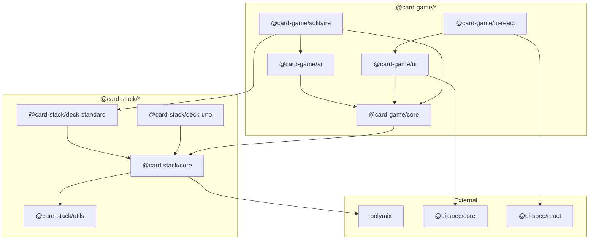

# Card Stack & Card Game Packages Specification

**Version:** 1.0.0  
**Status:** Complete Specification  
**License:** MIT

---

## Table of Contents

1. [Executive Summary](#executive-summary)
2. [Architecture Overview](#architecture-overview)
3. [Package Structure](#package-structure)
4. [Core Concepts](#core-concepts)
5. [Mixin System](#mixin-system)
6. [Entity System](#entity-system)
7. [UI Integration](#ui-integration)
8. [AI System](#ai-system)
9. [Persistence & Serialization](#persistence--serialization)
10. [Solitaire MVP](#solitaire-mvp)
11. [API Reference](#api-reference)
12. [Implementation Guidelines](#implementation-guidelines)
13. [Examples](#examples)

---

## Executive Summary

The `@card-stack/*` and `@card-game/*` packages provide a comprehensive, composable framework for building card games in TypeScript. The architecture emphasizes:

- **Composition over inheritance** via `polymix` mixins
- **Framework-agnostic core** with UI bindings for React, Vue, Svelte, etc.
- **Declarative UI** via `ui-spec` for rendering games from JSON schemas
- **AI-ready architecture** with decision trees generated from game rules
- **Type-safe** throughout with full TypeScript inference

### Key Differentiators

| Feature         | This Framework                | Traditional Approach    |
| --------------- | ----------------------------- | ----------------------- |
| Composition     | Polymix mixins                | Deep inheritance        |
| UI Rendering    | ui-spec JSON schemas          | Framework-specific code |
| AI Players      | Auto-generated decision trees | Manual implementation   |
| Cross-framework | React, Vue, Svelte, etc.      | Single framework        |
| Customization   | Configurable mixins           | Subclass overrides      |
| Serialization   | Normalized entity format      | Custom serializers      |

---

## Architecture Overview

```
┌─────────────────────────────────────────────────────────────────────────────┐
│                        Card Stack / Card Game Architecture                   │
├─────────────────────────────────────────────────────────────────────────────┤
│                                                                             │
│  ┌─────────────────────────────────────────────────────────────────────┐   │
│  │                        @card-stack/* (Core Engine)                   │   │
│  │                                                                      │   │
│  │  ┌──────────┐  ┌──────────┐  ┌──────────┐  ┌──────────────────┐    │   │
│  │  │  core    │  │  utils   │  │deck-std  │  │  deck-*          │    │   │
│  │  │          │  │          │  │          │  │  (uno, rook...)  │    │   │
│  │  │ • Mixins │  │ • Enums  │  │ • 52-card│  │                  │    │   │
│  │  │ • Card   │  │ • Random │  │ • SVGs   │  │                  │    │   │
│  │  │ • Deck   │  │ • ID Gen │  │          │  │                  │    │   │
│  │  └──────────┘  └──────────┘  └──────────┘  └──────────────────┘    │   │
│  └─────────────────────────────────────────────────────────────────────┘   │
│                                      │                                      │
│                                      ▼                                      │
│  ┌─────────────────────────────────────────────────────────────────────┐   │
│  │                        @card-game/* (Game Layer)                     │   │
│  │                                                                      │   │
│  │  ┌──────────┐  ┌──────────┐  ┌──────────┐  ┌──────────────────┐    │   │
│  │  │  core    │  │    ai    │  │    ui    │  │  ui-react        │    │   │
│  │  │          │  │          │  │          │  │  ui-vue          │    │   │
│  │  │ • Game   │  │ • Trees  │  │ • Layouts│  │  ui-svelte       │    │   │
│  │  │ • Player │  │ • Hints  │  │ • D&D    │  │  ...             │    │   │
│  │  │ • Rules  │  │ • Scoring│  │ • Access │  │                  │    │   │
│  │  └──────────┘  └──────────┘  └──────────┘  └──────────────────┘    │   │
│  │                                                                      │   │
│  │  ┌──────────┐  ┌──────────┐  ┌──────────┐  ┌──────────────────┐    │   │
│  │  │solitaire │  │ blackjack│  │  poker   │  │  more games...   │    │   │
│  │  └──────────┘  └──────────┘  └──────────┘  └──────────────────┘    │   │
│  └─────────────────────────────────────────────────────────────────────┘   │
│                                      │                                      │
│                                      ▼                                      │
│  ┌─────────────────────────────────────────────────────────────────────┐   │
│  │                           External Dependencies                       │   │
│  │                                                                      │   │
│  │  ┌──────────────────┐         ┌──────────────────────────────┐      │   │
│  │  │     polymix      │         │          ui-spec              │      │   │
│  │  │                  │         │                               │      │   │
│  │  │ • mix()          │         │ • JSON schemas                │      │   │
│  │  │ • mixWithBase()  │         │ • Framework bindings          │      │   │
│  │  │ • @mixin()       │         │ • Reactivity                  │      │   │
│  │  │ • strategies     │         │ • Validation                  │      │   │
│  │  └──────────────────┘         └──────────────────────────────┘      │   │
│  └─────────────────────────────────────────────────────────────────────┘   │
│                                                                             │
└─────────────────────────────────────────────────────────────────────────────┘
```

### Data Flow

```
┌─────────┐     ┌─────────┐     ┌─────────────┐     ┌──────────────┐
│  User   │────▶│   UI    │────▶│    Game     │────▶│   Entity     │
│ Action  │     │ Handler │     │   Logic     │     │   Updates    │
└─────────┘     └─────────┘     └─────────────┘     └──────────────┘
                                       │                    │
                                       ▼                    ▼
                                ┌─────────────┐     ┌──────────────┐
                                │     AI      │     │   UI-Spec    │
                                │   Engine    │     │   Schema     │
                                └─────────────┘     └──────────────┘
                                       │                    │
                                       ▼                    ▼
                                ┌─────────────┐     ┌──────────────┐
                                │   Hints/    │     │   Rendered   │
                                │   Moves     │     │     UI       │
                                └─────────────┘     └──────────────┘
```

---

## Package Structure

### Directory Layout

```
card-stack/
├── core/                          # @card-stack/core
│   ├── src/
│   │   ├── index.ts
│   │   ├── mixins/
│   │   │   ├── shared/
│   │   │   │   ├── Idable.ts
│   │   │   │   ├── Nameable.ts
│   │   │   │   ├── Ownable.ts
│   │   │   │   ├── Parentable.ts
│   │   │   │   ├── Childrenable.ts
│   │   │   │   └── index.ts
│   │   │   ├── card/
│   │   │   │   ├── Flippable.ts
│   │   │   │   ├── Rankable.ts
│   │   │   │   ├── Suitable.ts
│   │   │   │   └── index.ts
│   │   │   ├── cardset/
│   │   │   │   ├── Atable.ts
│   │   │   │   ├── Eachable.ts
│   │   │   │   ├── Findable.ts
│   │   │   │   ├── Filterable.ts
│   │   │   │   ├── Mapable.ts
│   │   │   │   ├── Reduceable.ts
│   │   │   │   ├── Reversible.ts
│   │   │   │   ├── Shuffleable.ts
│   │   │   │   ├── Takeable.ts
│   │   │   │   ├── Giveable.ts
│   │   │   │   ├── Sortable.ts
│   │   │   │   ├── Chunkable.ts
│   │   │   │   └── index.ts
│   │   │   ├── player/
│   │   │   │   ├── Handable.ts
│   │   │   │   ├── Scoreable.ts
│   │   │   │   └── index.ts
│   │   │   └── index.ts
│   │   ├── entities/
│   │   │   ├── Card.ts
│   │   │   ├── CardSet.ts
│   │   │   ├── CardDeck.ts
│   │   │   └── index.ts
│   │   └── utils/
│   │       ├── createEnum.ts
│   │       ├── idRegistry.ts
│   │       └── index.ts
│   ├── package.json
│   └── tsconfig.json
│
├── utils/                         # @card-stack/utils
│   ├── src/
│   │   ├── index.ts
│   │   ├── random.ts
│   │   ├── shuffle.ts
│   │   └── types.ts
│   └── package.json
│
├── deck-standard/                 # @card-stack/deck-standard
│   ├── src/
│   │   ├── index.ts
│   │   ├── StandardCard.ts
│   │   ├── StandardDeck.ts
│   │   ├── ranks.ts
│   │   ├── suits.ts
│   │   └── assets/
│   │       └── svg/
│   │           ├── hearts/
│   │           ├── diamonds/
│   │           ├── clubs/
│   │           └── spades/
│   └── package.json
│
├── deck-uno/                      # @card-stack/deck-uno
├── deck-rook/                     # @card-stack/deck-rook
├── deck-trading/                  # @card-stack/deck-trading
│
├── docs/                          # @card-stack/docs
│   ├── src/
│   ├── public/
│   └── package.json
│
└── game/                          # @card-game/* packages
    ├── core/                      # @card-game/core
    │   ├── src/
    │   │   ├── index.ts
    │   │   ├── Game.ts
    │   │   ├── Player.ts
    │   │   ├── Turn.ts
    │   │   ├── Move.ts
    │   │   ├── MoveDescriptor.ts
    │   │   ├── Rules.ts
    │   │   ├── Settings.ts
    │   │   └── mixins/
    │   │       ├── Turnable.ts
    │   │       ├── Undoable.ts
    │   │       ├── Winnable.ts
    │   │       └── index.ts
    │   └── package.json
    │
    ├── ai/                        # @card-game/ai
    │   ├── src/
    │   │   ├── index.ts
    │   │   ├── DecisionTree.ts
    │   │   ├── DecisionNode.ts
    │   │   ├── TreeGenerator.ts
    │   │   ├── MoveEvaluator.ts
    │   │   ├── Difficulty.ts
    │   │   └── schema/
    │   │       ├── tree.schema.json
    │   │       └── types.ts
    │   └── package.json
    │
    ├── ui/                        # @card-game/ui
    │   ├── src/
    │   │   ├── index.ts
    │   │   ├── layouts/
    │   │   │   ├── StackLayout.ts
    │   │   │   ├── FanLayout.ts
    │   │   │   ├── SpreadLayout.ts
    │   │   │   ├── GridLayout.ts
    │   │   │   ├── PileLayout.ts
    │   │   │   └── index.ts
    │   │   ├── interactions/
    │   │   │   ├── Draggable.ts
    │   │   │   ├── Droppable.ts
    │   │   │   ├── Tappable.ts
    │   │   │   ├── LongPressable.ts
    │   │   │   └── index.ts
    │   │   ├── schema/
    │   │   │   ├── SchemaBuilder.ts
    │   │   │   ├── QueryBinding.ts
    │   │   │   └── index.ts
    │   │   └── accessibility/
    │   │       ├── AriaLabels.ts
    │   │       ├── Announcer.ts
    │   │       └── index.ts
    │   └── package.json
    │
    ├── ui-react/                  # @card-game/ui-react
    │   ├── src/
    │   │   ├── index.ts
    │   │   ├── GameProvider.tsx
    │   │   ├── GameRenderer.tsx
    │   │   ├── components/
    │   │   │   ├── CardComponent.tsx
    │   │   │   ├── CardSetComponent.tsx
    │   │   │   ├── TableComponent.tsx
    │   │   │   ├── SettingsScreen.tsx
    │   │   │   └── index.ts
    │   │   ├── hooks/
    │   │   │   ├── useGame.ts
    │   │   │   ├── useCard.ts
    │   │   │   ├── useDrag.ts
    │   │   │   ├── useDrop.ts
    │   │   │   └── index.ts
    │   │   └── adapters/
    │   │       └── UISpecAdapter.tsx
    │   └── package.json
    │
    ├── ui-vue/                    # @card-game/ui-vue
    ├── ui-svelte/                 # @card-game/ui-svelte
    ├── ui-web/                    # @card-game/ui-web (Web Components)
    │
    ├── multiplayer/               # @card-game/multiplayer
    ├── online-multiplayer/        # @card-game/online-multiplayer
    │
    ├── utils/                     # @card-game/utils
    │
    └── solitaire/                 # @card-game/solitaire
        ├── src/
        │   ├── index.ts
        │   ├── SolitaireGame.ts
        │   ├── zones/
        │   │   ├── Stock.ts
        │   │   ├── Waste.ts
        │   │   ├── Foundation.ts
        │   │   ├── Tableau.ts
        │   │   └── index.ts
        │   ├── settings/
        │   │   ├── SolitaireSettings.ts
        │   │   ├── settingsSchema.ts
        │   │   └── index.ts
        │   ├── ai/
        │   │   ├── SolitaireAI.ts
        │   │   ├── heuristics.ts
        │   │   └── index.ts
        │   └── schema/
        │       ├── tableLayout.ts
        │       └── index.ts
        └── package.json
```

### Package Dependencies



---

## Core Concepts

### Entity Identity

Every game entity that participates in the game state MUST be uniquely identifiable. This is achieved through the `Idable` mixin.

#### ID Requirements

1. **Format**: UUIDv7 string (time-ordered for efficient sorting)
2. **Uniqueness**: Globally unique within a `Game` instance
3. **Stability**: Never changes for the lifetime of a `Game`
4. **Persistence**: Preserved across serialization/rehydration
5. **Registry**: GC-safe global registry prevents duplicates

```typescript
// ID format: UUIDv7
// Example: "019006d6-8e8a-7b1d-8f9e-8e8a7b1d8f9e"
```

### Entity Lifecycle

```
┌─────────────┐     ┌─────────────┐     ┌─────────────┐
│   Created   │────▶│   Active    │────▶│  Disposed   │
│  (new Game) │     │ (in play)   │     │ (GC'd)      │
└─────────────┘     └─────────────┘     └─────────────┘
       │                   │                   │
       ▼                   ▼                   ▼
   ID assigned        ID unchanged         ID removed
   to registry        in registry          from registry
```

### Iterable Enums

Rank and Suit types follow the "iterable enum" pattern using `createEnum`:

```typescript
// Creates enum with:
// - Forward mapping: Enum.Key -> number
// - Reverse mapping: Enum[number] -> Key
// - Iteration via Symbol.iterator

const Rank = createEnum(['Ace', 'Two', 'Three', ..., 'King']);

Rank.Ace        // 0
Rank[0]         // 'Ace'
[...Rank]       // [0, 1, 2, ..., 12]

for (const rank of Rank) {
  console.log(Rank[rank]); // 'Ace', 'Two', etc.
}
```

### Configuration Pattern

Mixins support static configuration via `configMixin()`:

```typescript
// Base mixin with configurable behavior
class Flippable {
	static configMixin(faceDown: boolean = false) {
		return class ConfiguredFlippable extends this {
			flipped = faceDown;
		};
	}

	flipped = false;
	get isFaceUp() {
		return !this.flipped;
	}
	get isFaceDown() {
		return this.flipped;
	}
	flip() {
		this.flipped = !this.flipped;
	}
	flipUp() {
		this.flipped = false;
	}
	flipDown() {
		this.flipped = true;
	}
}

// Usage
const FaceDownFlippable = Flippable.configMixin(true);

@mixin(FaceDownFlippable)
class MyCard extends Card {}
```

---

## Mixin System

This project uses `polymix` for all mixin composition. Key patterns:

### Basic Composition

```typescript
import { mix, mixWithBase, mixin } from 'polymix';

// Option 1: Extend mixed base
class Card extends mix(Idable, Flippable, Rankable, Suitable) {
	constructor(rank: number, suit: number) {
		super();
		this.rank = rank;
		this.suit = suit;
	}
}

// Option 2: Explicit base class
class StandardCard extends mixWithBase(Card, Colorable) {
	get color() {
		return this.suit <= 1 ? 'red' : 'black';
	}
}

// Option 3: Decorator syntax
@mixin(Shuffleable, Takeable, Giveable)
class Deck extends CardSet {}
```

### Configurable Mixins

```typescript
import { mix } from 'polymix';

// Configurable mixin pattern
class Rankable {
  static RANK: IterableEnum = createEnum(['Ace', 'Two', ...]);

  static configMixin(ranks: IterableEnum) {
    return class ConfiguredRankable extends this {
      static RANK = ranks;
    };
  }

  rank: number = 0;

  get rankName(): string {
    return (this.constructor as typeof Rankable).RANK[this.rank];
  }

  get rankValue(): number {
    return this.rank;
  }
}

// Usage with custom ranks
const UnoRanks = createEnum(['Zero', 'One', 'Two', ...]);

class UnoCard extends mix(
  Idable,
  Rankable.configMixin(UnoRanks),
  Colorable
) {}
```

### instanceof Checks

`polymix` makes `instanceof` work correctly:

```typescript
const card = new Card(0, 0);

card instanceof Card; // true
card instanceof Idable; // true
card instanceof Flippable; // true
card instanceof Rankable; // true
card instanceof Suitable; // true

// For configured mixins, use the configured class
const FaceDownFlippable = Flippable.configMixin(true);
card instanceof FaceDownFlippable; // depends on what was mixed in
```

### Conflict Resolution

When mixins define the same method, use polymix strategies:

```typescript
import { mix, pipe, merge, from } from 'polymix';

class ValidatorA {
	validate(card: Card): boolean {
		return card.rank > 0;
	}
}

class ValidatorB {
	validate(card: Card): boolean {
		return card.isFaceUp;
	}
}

class CombinedValidator extends mix(ValidatorA, ValidatorB) {
	// Run both validations, return last result
	@override
	validate(card: Card): boolean {
		return false; // placeholder, implementations come from mixins
	}
}

// Or use specific implementations
class CustomValidator extends mix(ValidatorA, ValidatorB) {
	validate(card: Card): boolean {
		// Explicitly call specific mixin's implementation
		const a = from(this, ValidatorA).validate(card);
		const b = from(this, ValidatorB).validate(card);
		return a && b;
	}
}
```

---

## Entity System

### Shared Mixins

#### Idable

Creates stable, unique identifiers for entities.

```typescript
interface IdableConfig {
	// Optional: provide ID during rehydration
	id?: string;
}

class Idable {
	// Global registry (GC-safe via WeakRef)
	private static registry = new Map<string, WeakRef<Idable>>();
	private static finalization = new FinalizationRegistry<string>((id) =>
		Idable.registry.delete(id),
	);

	readonly id: string;

	constructor(config?: IdableConfig) {
		this.id = config?.id ?? generateUUIDv7();

		if (Idable.registry.has(this.id)) {
			throw new Error(`Duplicate ID: ${this.id}`);
		}

		Idable.registry.set(this.id, new WeakRef(this));
		Idable.finalization.register(this, this.id);
	}

	static getById<T extends Idable>(
		this: new (...args: any[]) => T,
		id: string,
	): T | undefined {
		const ref = Idable.registry.get(id);
		const instance = ref?.deref();
		return instance instanceof this ? instance : undefined;
	}

	static hasId(id: string): boolean {
		const ref = Idable.registry.get(id);
		return ref?.deref() !== undefined;
	}
}
```

**Usage:**

```typescript
class Card extends mix(Idable, Flippable, Rankable, Suitable) {}

const card = new Card();
card.id; // "019006d6-8e8a-7b1d-8f9e-8e8a7b1d8f9e"

Card.getById(card.id); // card
Card.hasId(card.id); // true
CardSet.getById(card.id); // undefined (type-specific lookup)
```

#### Nameable

Adds a `name` property.

```typescript
interface NameableConfig {
	name?: string;
}

class Nameable {
	name: string = '';

	static configMixin(defaultName: string) {
		return class ConfiguredNameable extends this {
			name = defaultName;
		};
	}
}
```

#### Ownable

Associates an entity with an owner (typically a Player).

```typescript
interface OwnableConfig<T = unknown> {
	owner?: T;
}

class Ownable<T = unknown> {
	owner?: T;

	static configMixin<O>() {
		return class ConfiguredOwnable extends (this as unknown as typeof Ownable<O>) {
			owner?: O;
		};
	}

	setOwner(owner: T): this {
		this.owner = owner;
		return this;
	}

	clearOwner(): this {
		this.owner = undefined;
		return this;
	}

	isOwnedBy(owner: T): boolean {
		return this.owner === owner;
	}
}
```

#### Parentable

Creates parent-child relationships.

```typescript
interface ParentableConfig<T = unknown> {
	parent?: T;
	parentPropertyName?: string;
}

class Parentable<T = unknown> {
	protected _parent?: T;

	static configMixin<P>(
		propertyName: string = 'parent',
		parentType?: new (...args: any[]) => P,
	) {
		// Returns configured mixin with custom property name
		return class ConfiguredParentable extends this {
			get [propertyName](): P | undefined {
				return this._parent as P | undefined;
			}

			set [propertyName](value: P | undefined) {
				this._parent = value as unknown as T;
			}
		};
	}

	get parent(): T | undefined {
		return this._parent;
	}

	set parent(value: T | undefined) {
		this._parent = value;
	}

	hasAncestor(ancestor: T): boolean {
		let current: any = this._parent;
		while (current) {
			if (current === ancestor) return true;
			current = current._parent ?? current.parent;
		}
		return false;
	}
}

// Usage: Create "deck" property instead of "parent"
const Deckable = Parentable.configMixin<CardDeck>('deck');

@mixin(Deckable)
class Card {
	deck?: CardDeck; // typed property
}
```

#### Childrenable

Manages child entity collections with private storage.

```typescript
interface ChildrenableConfig {
	childrenPropertyName?: string;
	childType?: new (...args: any[]) => unknown;
}

class Childrenable<T = unknown> {
	// Private storage - not publicly mutable
	#children: T[] = [];

	static configMixin<C>(
		propertyName: string = 'children',
		childType?: new (...args: any[]) => C,
	) {
		// Module-private WeakMap for storage (allows mixin method access)
		const storage = new WeakMap<object, C[]>();

		return class ConfiguredChildrenable {
			constructor() {
				storage.set(this, []);
			}

			protected get _childrenStorage(): C[] {
				return storage.get(this) ?? [];
			}

			protected set _childrenStorage(value: C[]) {
				storage.set(this, value);
			}

			get [propertyName](): readonly C[] {
				return Object.freeze([...this._childrenStorage]);
			}

			get childCount(): number {
				return this._childrenStorage.length;
			}

			hasChild(child: C): boolean {
				return this._childrenStorage.includes(child);
			}

			*[Symbol.iterator](): Iterator<C> {
				yield* this._childrenStorage;
			}
		};
	}
}
```

### Card Mixins

#### Flippable

Manages card face-up/face-down state.

```typescript
interface FlippableConfig {
	faceDown?: boolean;
}

class Flippable {
	flipped: boolean = false;

	static configMixin(faceDown: boolean = false) {
		return class ConfiguredFlippable extends this {
			flipped = faceDown;
		};
	}

	get isFaceUp(): boolean {
		return !this.flipped;
	}

	get isFaceDown(): boolean {
		return this.flipped;
	}

	flip(): this {
		this.flipped = !this.flipped;
		return this;
	}

	flipUp(): this {
		this.flipped = false;
		return this;
	}

	flipDown(): this {
		this.flipped = true;
		return this;
	}
}
```

#### Rankable

Adds card rank with iterable enum support.

```typescript
type IterableEnum<T extends string = string> = {
	[K in T]: number;
} & {
	[key: number]: T;
	[Symbol.iterator](): Iterator<number>;
};

interface RankableConfig {
	rank?: number;
	ranks?: IterableEnum;
}

class Rankable {
	static RANK: IterableEnum = createEnum([
		'Ace',
		'Two',
		'Three',
		'Four',
		'Five',
		'Six',
		'Seven',
		'Eight',
		'Nine',
		'Ten',
		'Jack',
		'Queen',
		'King',
	]);

	rank: number = 0;

	static configMixin(ranks: IterableEnum) {
		return class ConfiguredRankable extends this {
			static RANK = ranks;
		};
	}

	get rankName(): string {
		const Ctor = this.constructor as typeof Rankable;
		return Ctor.RANK[this.rank];
	}

	get rankValue(): number {
		return this.rank;
	}

	compareRank(other: Rankable): number {
		return this.rank - other.rank;
	}

	isHigherRank(other: Rankable): boolean {
		return this.rank > other.rank;
	}

	isLowerRank(other: Rankable): boolean {
		return this.rank < other.rank;
	}

	isSameRank(other: Rankable): boolean {
		return this.rank === other.rank;
	}

	isNextRank(other: Rankable): boolean {
		return this.rank === other.rank + 1;
	}

	isPreviousRank(other: Rankable): boolean {
		return this.rank === other.rank - 1;
	}
}
```

#### Suitable

Adds card suit with iterable enum support.

```typescript
interface SuitableConfig {
	suit?: number;
	suits?: IterableEnum;
}

class Suitable {
	static SUIT: IterableEnum = createEnum([
		'Hearts',
		'Diamonds',
		'Clubs',
		'Spades',
	]);

	suit: number = 0;

	static configMixin(suits: IterableEnum) {
		return class ConfiguredSuitable extends this {
			static SUIT = suits;
		};
	}

	get suitName(): string {
		const Ctor = this.constructor as typeof Suitable;
		return Ctor.SUIT[this.suit];
	}

	get suitValue(): number {
		return this.suit;
	}

	compareSuit(other: Suitable): number {
		return this.suit - other.suit;
	}

	isSameSuit(other: Suitable): boolean {
		return this.suit === other.suit;
	}

	isDifferentSuit(other: Suitable): boolean {
		return this.suit !== other.suit;
	}
}
```

### CardSet Mixins

All CardSet mixins operate on the internal `_childrenStorage` array from `Childrenable`.

#### Read-Only Mixins

```typescript
// Atable - Access by index
class Atable {
	at(index: number): Card | undefined {
		const storage = this._childrenStorage;
		if (index < 0) {
			return storage[storage.length + index];
		}
		return storage[index];
	}

	first(): Card | undefined {
		return this.at(0);
	}

	last(): Card | undefined {
		return this.at(-1);
	}
}

// Eachable - Iterate with callback
class Eachable {
	each(callback: (card: Card, index: number) => void): void {
		this._childrenStorage.forEach(callback);
	}
}

// Findable - Find single card
class Findable {
	find(predicate: (card: Card, index: number) => boolean): Card | undefined {
		return this._childrenStorage.find(predicate);
	}

	findIndex(predicate: (card: Card, index: number) => boolean): number {
		return this._childrenStorage.findIndex(predicate);
	}
}

// Filterable - Filter cards
class Filterable {
	filter(predicate: (card: Card, index: number) => boolean): Card[] {
		return this._childrenStorage.filter(predicate);
	}
}

// Mapable - Transform cards
class Mapable {
	map<T>(callback: (card: Card, index: number) => T): T[] {
		return this._childrenStorage.map(callback);
	}
}

// Reduceable - Reduce to value
class Reduceable {
	reduce<T>(
		callback: (accumulator: T, card: Card, index: number) => T,
		initialValue: T,
	): T {
		return this._childrenStorage.reduce(callback, initialValue);
	}
}

// Chunkable - Split into groups
class Chunkable {
	chunk(size: number): Card[][] {
		const chunks: Card[][] = [];
		const storage = this._childrenStorage;
		for (let i = 0; i < storage.length; i += size) {
			chunks.push(storage.slice(i, i + size));
		}
		return chunks;
	}
}
```

#### Mutation Mixins

These mixins provide controlled mutation of the card collection:

```typescript
// Shuffleable - Randomize order
class Shuffleable {
	shuffle(rng?: () => number): this {
		const storage = [...this._childrenStorage];
		const random = rng ?? Math.random;

		// Fisher-Yates shuffle
		for (let i = storage.length - 1; i > 0; i--) {
			const j = Math.floor(random() * (i + 1));
			[storage[i], storage[j]] = [storage[j], storage[i]];
		}

		this._childrenStorage = storage;
		return this;
	}
}

// Reversible - Reverse order
class Reversible {
	reverse(): this {
		this._childrenStorage = [...this._childrenStorage].reverse();
		return this;
	}
}

// Sortable - Sort cards
class Sortable {
	sort(compareFn?: (a: Card, b: Card) => number): this {
		const defaultCompare = (a: Card, b: Card) => {
			const suitDiff = a.suit - b.suit;
			if (suitDiff !== 0) return suitDiff;
			return a.rank - b.rank;
		};

		this._childrenStorage = [...this._childrenStorage].sort(
			compareFn ?? defaultCompare,
		);
		return this;
	}
}

// Takeable - Remove cards from this set
class Takeable {
	take(count: number = 1): Card[] {
		const storage = this._childrenStorage;
		const taken = storage.splice(0, count);
		this._childrenStorage = storage;
		return taken;
	}

	takeFrom(index: number, count: number = 1): Card[] {
		const storage = this._childrenStorage;
		const taken = storage.splice(index, count);
		this._childrenStorage = storage;
		return taken;
	}

	takeLast(count: number = 1): Card[] {
		const storage = this._childrenStorage;
		const taken = storage.splice(-count, count);
		this._childrenStorage = storage;
		return taken;
	}

	takeCard(card: Card): Card | undefined {
		const storage = this._childrenStorage;
		const index = storage.indexOf(card);
		if (index === -1) return undefined;
		const [taken] = storage.splice(index, 1);
		this._childrenStorage = storage;
		return taken;
	}

	takeAll(): Card[] {
		const all = [...this._childrenStorage];
		this._childrenStorage = [];
		return all;
	}
}

// Giveable - Add cards to this set
class Giveable {
	give(...cards: Card[]): this {
		this._childrenStorage = [...this._childrenStorage, ...cards];
		return this;
	}

	giveToTop(...cards: Card[]): this {
		this._childrenStorage = [...cards, ...this._childrenStorage];
		return this;
	}

	giveAt(index: number, ...cards: Card[]): this {
		const storage = [...this._childrenStorage];
		storage.splice(index, 0, ...cards);
		this._childrenStorage = storage;
		return this;
	}

	// Transfer cards from another set
	receiveFrom(source: Takeable, count: number = 1): this {
		const cards = source.take(count);
		return this.give(...cards);
	}

	receiveAllFrom(source: Takeable): this {
		const cards = source.takeAll();
		return this.give(...cards);
	}
}
```

### Card Entity

The base `Card` class composes all card mixins:

```typescript
import { mix } from 'polymix';

class Card extends mix(
	Idable,
	Flippable,
	Rankable,
	Suitable,
	Parentable.configMixin<CardSet>('cardSet'),
) {
	constructor(rank: number, suit: number, options?: { id?: string }) {
		super(options);
		this.rank = rank;
		this.suit = suit;
	}

	// Convenience accessors
	get deck(): CardDeck | undefined {
		return this.cardSet?.deck;
	}

	toString(): string {
		return `${this.rankName} of ${this.suitName}`;
	}

	toJSON(): CardJSON {
		return {
			id: this.id,
			rank: this.rank,
			suit: this.suit,
			flipped: this.flipped,
		};
	}

	static fromJSON(json: CardJSON): Card {
		const card = new Card(json.rank, json.suit, { id: json.id });
		card.flipped = json.flipped;
		return card;
	}
}

interface CardJSON {
	id: string;
	rank: number;
	suit: number;
	flipped: boolean;
}
```

### CardSet Entity

```typescript
import { mix } from 'polymix';

// Read-only operations
const CardSetReadable = mix(
	Atable,
	Eachable,
	Findable,
	Filterable,
	Mapable,
	Reduceable,
	Chunkable,
);

// Full CardSet with all operations
class CardSet extends mixWithBase(
	mix(
		Idable,
		Nameable,
		Childrenable.configMixin<Card>('cards'),
		Parentable.configMixin<CardDeck | Game>('parent'),
	),
	CardSetReadable,
	Shuffleable,
	Reversible,
	Sortable,
	Takeable,
	Giveable,
) {
	constructor(options?: { id?: string; name?: string; cards?: Card[] }) {
		super(options);
		if (options?.name) this.name = options.name;
		if (options?.cards) this.give(...options.cards);
	}

	get isEmpty(): boolean {
		return this.childCount === 0;
	}

	get count(): number {
		return this.childCount;
	}

	// Iteration
	*[Symbol.iterator](): Iterator<Card> {
		yield* this._childrenStorage;
	}

	toJSON(): CardSetJSON {
		return {
			id: this.id,
			name: this.name,
			cardIds: this._childrenStorage.map((c) => c.id),
		};
	}
}

interface CardSetJSON {
	id: string;
	name: string;
	cardIds: string[];
}
```

### CardDeck Entity

```typescript
import { mix, mixin } from 'polymix';

// Drawable mixin for decks
class Drawable {
	draw(count: number = 1): Card[] {
		return (this as unknown as Takeable).take(count);
	}

	drawTo(destination: Giveable, count: number = 1): Card[] {
		const cards = this.draw(count);
		destination.give(...cards);
		return cards;
	}
}

@mixin(Drawable, Shuffleable)
class CardDeck extends CardSet {
	constructor(options?: {
		id?: string;
		name?: string;
		cards?: Card[];
		shuffled?: boolean;
	}) {
		super(options);
		if (options?.shuffled) this.shuffle();
	}

	// Factory for standard 52-card deck
	static createStandard(options?: { shuffled?: boolean }): CardDeck {
		const cards: Card[] = [];

		for (const suit of Suitable.SUIT) {
			for (const rank of Rankable.RANK) {
				cards.push(new Card(rank, suit));
			}
		}

		return new CardDeck({
			name: 'Standard Deck',
			cards,
			shuffled: options?.shuffled,
		});
	}

	reset(): this {
		// Flip all cards face down
		this.each((card) => card.flipDown());
		// Return to original order
		this.sort();
		return this;
	}
}
```

### Player Mixins

#### Handable

Gives a player a hand of cards.

```typescript
interface HandableConfig {
	handPropertyName?: string;
}

class Handable {
	#hand: CardSet;

	static configMixin(propertyName: string = 'hand') {
		const storage = new WeakMap<object, CardSet>();

		return class ConfiguredHandable {
			constructor() {
				storage.set(this, new CardSet({ name: `${propertyName}` }));
			}

			get [propertyName](): CardSet {
				return storage.get(this)!;
			}
		};
	}

	get hand(): CardSet {
		return this.#hand;
	}

	constructor() {
		this.#hand = new CardSet({ name: 'Hand' });
	}
}
```

#### Scoreable

Manages player scoring.

```typescript
interface ScoreableConfig {
	initialScore?: number;
	minScore?: number;
	maxScore?: number;
	scorePropertyName?: string;
}

class Scoreable {
	#score: number = 0;
	#minScore: number = -Infinity;
	#maxScore: number = Infinity;

	static configMixin(config: ScoreableConfig = {}) {
		const {
			initialScore = 0,
			minScore = -Infinity,
			maxScore = Infinity,
			scorePropertyName = 'score',
		} = config;

		return class ConfiguredScoreable extends this {
			#score = initialScore;
			#minScore = minScore;
			#maxScore = maxScore;
		};
	}

	get score(): number {
		return this.#score;
	}

	addScore(amount: number): this {
		this.#score = Math.min(this.#maxScore, this.#score + amount);
		return this;
	}

	subScore(amount: number): this {
		this.#score = Math.max(this.#minScore, this.#score - amount);
		return this;
	}

	setScore(value: number): this {
		this.#score = Math.max(this.#minScore, Math.min(this.#maxScore, value));
		return this;
	}

	resetScore(): this {
		this.#score = 0;
		return this;
	}
}
```

### Player Entity

```typescript
import { mix } from 'polymix';

class Player extends mix(Idable, Nameable, Handable, Scoreable) {
	isHuman: boolean = true;

	constructor(
		name: string,
		options?: {
			id?: string;
			isHuman?: boolean;
			initialScore?: number;
		},
	) {
		super(options);
		this.name = name;
		this.isHuman = options?.isHuman ?? true;
		if (options?.initialScore !== undefined) {
			this.setScore(options.initialScore);
		}
	}

	toJSON(): PlayerJSON {
		return {
			id: this.id,
			name: this.name,
			isHuman: this.isHuman,
			score: this.score,
			handId: this.hand.id,
		};
	}
}

interface PlayerJSON {
	id: string;
	name: string;
	isHuman: boolean;
	score: number;
	handId: string;
}
```

---

## UI Integration

### Overview

Game rendering is handled through `ui-spec`, a framework-agnostic library for rendering UIs from JSON schemas. The `@card-game/ui` package provides the bridge between game entities and ui-spec schemas.

### Architecture

```
┌─────────────────────────────────────────────────────────────────┐
│                         @card-game/ui                            │
│                                                                  │
│  ┌─────────────────┐    ┌─────────────────┐    ┌─────────────┐ │
│  │  Layout Mixins  │    │  Interactions   │    │  Schema     │ │
│  │                 │    │                 │    │  Builder    │ │
│  │  • StackLayout  │    │  • Draggable    │    │             │ │
│  │  • FanLayout    │    │  • Droppable    │    │  • Nodes    │ │
│  │  • SpreadLayout │    │  • Tappable     │    │  • Queries  │ │
│  │  • GridLayout   │    │  • LongPress    │    │  • Bindings │ │
│  │  • PileLayout   │    │                 │    │             │ │
│  └─────────────────┘    └─────────────────┘    └─────────────┘ │
│                                                                  │
└─────────────────────────────────────────────────────────────────┘
                                │
                                ▼
┌─────────────────────────────────────────────────────────────────┐
│                      @ui-spec/core                               │
│                                                                  │
│  • JSON Schema parsing                                           │
│  • Reactive data store (JSONPath)                                │
│  • UIScript functions                                            │
│  • Component composition                                         │
└─────────────────────────────────────────────────────────────────┘
                                │
                                ▼
┌─────────────────────────────────────────────────────────────────┐
│               @card-game/ui-react (or other framework)           │
│                                                                  │
│  • React-specific rendering                                      │
│  • Hooks for game state                                          │
│  • Framework-specific DnD                                        │
└─────────────────────────────────────────────────────────────────┘
```

### Layout Mixins

Layout mixins define how CardSets are visually arranged:

```typescript
// Base layout interface
interface LayoutConfig {
	cardClassName?: ClassNameValue;
	containerClassName?: ClassNameValue;
	gap?: number | string;
	maxCards?: number;
}

type ClassNameValue =
	| string
	| string[]
	| ((...args: any[]) => string | string[]);

// Stack Layout - cards stacked with offset
class StackLayout {
	static configMixin(config: StackLayoutConfig) {
		return class ConfiguredStackLayout extends this {
			static layoutConfig = config;
		};
	}

	static layoutConfig: StackLayoutConfig = {
		direction: 'vertical',
		offset: 20,
		cardClassName: 'rounded-lg shadow-md',
	};
}

interface StackLayoutConfig extends LayoutConfig {
	direction?: 'vertical' | 'horizontal';
	offset?: number;
	faceDownOffset?: number;
}

// Fan Layout - cards spread in arc
class FanLayout {
	static configMixin(config: FanLayoutConfig) {
		return class ConfiguredFanLayout extends this {
			static layoutConfig = config;
		};
	}

	static layoutConfig: FanLayoutConfig = {
		maxAngle: 45,
		radius: 200,
		cardClassName: (card, index, total) => {
			const rotation = calculateFanRotation(index, total);
			return `transform rotate-[${rotation}deg]`;
		},
	};
}

interface FanLayoutConfig extends LayoutConfig {
	maxAngle?: number;
	radius?: number;
	spreadDirection?: 'left' | 'right' | 'center';
}

// Spread Layout - horizontal row
class SpreadLayout {
	static configMixin(config: SpreadLayoutConfig) {
		return class ConfiguredSpreadLayout extends this {
			static layoutConfig = config;
		};
	}

	static layoutConfig: SpreadLayoutConfig = {
		overlap: 30,
		maxVisible: 7,
		containerClassName: 'flex flex-row',
	};
}

interface SpreadLayoutConfig extends LayoutConfig {
	overlap?: number;
	maxVisible?: number;
	showHidden?: boolean;
}

// Grid Layout - rows and columns
class GridLayout {
	static configMixin(config: GridLayoutConfig) {
		return class ConfiguredGridLayout extends this {
			static layoutConfig = config;
		};
	}

	static layoutConfig: GridLayoutConfig = {
		columns: 4,
		gap: 16,
		containerClassName: 'grid',
	};
}

interface GridLayoutConfig extends LayoutConfig {
	columns?: number | { default: number; md?: number; lg?: number };
	rows?: number;
}

// Pile Layout - single stack showing top card
class PileLayout {
	static configMixin(config: PileLayoutConfig) {
		return class ConfiguredPileLayout extends this {
			static layoutConfig = config;
		};
	}

	static layoutConfig: PileLayoutConfig = {
		showCount: true,
		countPosition: 'top-right',
	};
}

interface PileLayoutConfig extends LayoutConfig {
	showCount?: boolean;
	countPosition?: 'top-left' | 'top-right' | 'bottom-left' | 'bottom-right';
	emptyPlaceholder?: boolean;
}
```

### Interaction Mixins

```typescript
// Draggable - enables drag from this zone
class Draggable {
	static configMixin(config: DraggableConfig) {
		return class ConfiguredDraggable extends this {
			static dragConfig = config;
		};
	}

	static dragConfig: DraggableConfig = {
		enabled: true,
		multiCard: false,
	};

	// Override in game-specific zones
	canDrag(card: Card): boolean {
		return true;
	}

	// Get additional cards to drag (for multi-card)
	getDragStack(card: Card): Card[] {
		return [card];
	}

	// Called when drag starts
	onDragStart(card: Card, stack: Card[]): void {}

	// Called when drag ends (regardless of drop)
	onDragEnd(card: Card, stack: Card[], dropped: boolean): void {}
}

interface DraggableConfig {
	enabled?: boolean;
	multiCard?: boolean;
	dragPreview?: 'card' | 'stack' | 'count' | 'custom';
	dragHandle?: string; // CSS selector
}

// Droppable - enables drop onto this zone
class Droppable {
	static configMixin(config: DroppableConfig) {
		return class ConfiguredDroppable extends this {
			static dropConfig = config;
		};
	}

	static dropConfig: DroppableConfig = {
		enabled: true,
		acceptMultiple: true,
	};

	// MUST be implemented by game zones
	abstract canDrop(
		card: Card,
		stack: Card[],
		source: CardSet,
	): boolean | string | DropResult;

	// Called when valid drop occurs
	onDrop(card: Card, stack: Card[], source: CardSet): void {
		// Default: transfer cards
		for (const c of stack) {
			source.takeCard(c);
		}
		this.give(...stack);
	}
}

interface DroppableConfig {
	enabled?: boolean;
	acceptMultiple?: boolean;
	highlightValid?: boolean;
	highlightInvalid?: boolean;
}

interface DropResult {
	ok: boolean;
	message?: string;
	severity?: 'info' | 'warning' | 'error';
	ui?: {
		kind: 'toast' | 'modal' | 'alert' | 'sound' | 'none';
		layout?: Record<string, unknown>;
		[key: string]: unknown;
	};
}

// Tappable - single/double tap interactions
class Tappable {
	static configMixin(config: TappableConfig) {
		return class ConfiguredTappable extends this {
			static tapConfig = config;
		};
	}

	static tapConfig: TappableConfig = {
		enabled: true,
		doubleTapEnabled: true,
		doubleTapDelay: 300,
	};

	// Single tap handler
	onTap(card: Card): void {}

	// Double tap handler - auto-move to best destination
	onDoubleTap(card: Card): void {}
}

interface TappableConfig {
	enabled?: boolean;
	doubleTapEnabled?: boolean;
	doubleTapDelay?: number;
}

// LongPressable - hint/context menu
class LongPressable {
	static configMixin(config: LongPressableConfig) {
		return class ConfiguredLongPressable extends this {
			static longPressConfig = config;
		};
	}

	static longPressConfig: LongPressableConfig = {
		enabled: true,
		delay: 500,
		action: 'hint',
	};

	// Long press handler
	onLongPress(card: Card): void {}
}

interface LongPressableConfig {
	enabled?: boolean;
	delay?: number;
	action?: 'hint' | 'menu' | 'custom';
}
```

### Schema System

The schema system bridges game entities to ui-spec:

```typescript
// Schema node types - derived from mixin composition
type SchemaNodeType =
	| 'CardSet:StackLayout'
	| 'CardSet:FanLayout'
	| 'CardSet:SpreadLayout'
	| 'CardSet:GridLayout'
	| 'CardSet:PileLayout'
	| 'Card'
	| 'Player'
	| 'Game'
	| string; // Extensible

interface SchemaNode {
	// Node identification
	type: SchemaNodeType;
	entityId?: string; // Bind to specific entity by ID
	entityQuery?: EntityQuery; // Bind to multiple entities

	// Mixin metadata (for type derivation)
	mixins?: string[];

	// Children nodes
	children?: SchemaNode[];

	// Styling (Tailwind)
	className?: ClassNameValue;

	// Interaction bindings
	draggable?: boolean | DraggableConfig;
	droppable?: boolean | DroppableConfig;
	tappable?: boolean | TappableConfig;
	longPressable?: boolean | LongPressableConfig;

	// Accessibility
	ariaLabel?: string | { $fn: string };
	ariaDescription?: string | { $fn: string };
	role?: string;

	// Conditional rendering
	$if?: { $path: string } | { $fn: string };

	// Iteration
	$for?: {
		each: { $path: string } | EntityQuery;
		as: string;
		key?: string;
		template: SchemaNode;
	};
}

// Entity queries for binding
interface EntityQuery {
	kind: 'all' | 'byId' | 'childrenOf' | 'filter';
	type: string; // Entity class name: 'Card', 'CardSet', etc.
}

interface AllQuery extends EntityQuery {
	kind: 'all';
}

interface ByIdQuery extends EntityQuery {
	kind: 'byId';
	ids: string[];
}

interface ChildrenOfQuery extends EntityQuery {
	kind: 'childrenOf';
	parentType: string;
	parentId: string;
}

interface FilterQuery extends EntityQuery {
	kind: 'filter';
	source: EntityQuery;
	where: { $fn: string }; // (entity, game) => boolean
}
```

### Schema Builder

```typescript
class SchemaBuilder {
  private nodes: SchemaNode[] = [];

  // Add a CardSet with layout
  addCardSet(
    cardSet: CardSet,
    layout: typeof StackLayout | typeof FanLayout | /* etc */,
    config?: Partial<SchemaNode>
  ): this {
    const layoutConfig = layout.layoutConfig;
    const typeName = `CardSet:${layout.name}`;

    this.nodes.push({
      type: typeName as SchemaNodeType,
      entityId: cardSet.id,
      mixins: getMixinNames(cardSet),
      className: layoutConfig.containerClassName,
      draggable: cardSet instanceof Draggable,
      droppable: cardSet instanceof Droppable,
      children: [{
        $for: {
          each: { kind: 'childrenOf', type: 'Card', parentType: 'CardSet', parentId: cardSet.id },
          as: 'card',
          key: 'id',
          template: {
            type: 'Card',
            entityId: { $path: '$card.id' },
            className: layoutConfig.cardClassName,
          }
        }
      }],
      ...config,
    });

    return this;
  }

  // Build final schema
  build(): UISpecSchema {
    return {
      $uispec: '1.0',
      root: {
        type: 'div',
        className: 'game-table',
        children: this.nodes,
      },
    };
  }
}
```

### UI-Spec Data Binding

Game state is bound to ui-spec's reactive store:

```typescript
// Canonical serialization format
interface GameStateSchema {
	game: {
		id: string;
		type: string;
		createdAt?: string;
	};
	schema: unknown; // The UI schema
	entities: {
		Card: Record<string, CardJSON>;
		CardSet: Record<string, CardSetJSON>;
		Player: Record<string, PlayerJSON>;
		[type: string]: Record<string, unknown>;
	};
	roots: {
		deck?: string;
		players?: string[];
		[label: string]: string | string[] | undefined;
	};
}

// Bind game to ui-spec store
function bindGameToStore(game: Game, store: UISpecStore): void {
	// Initial population
	store.set('$.game', game.toJSON());
	store.set('$.entities', serializeEntities(game));
	store.set('$.roots', game.getRoots());

	// Listen for game events
	game.on('entityChanged', (entity: Idable) => {
		const type = entity.constructor.name;
		store.set(`$.entities.${type}.${entity.id}`, entity.toJSON());
	});

	game.on('entityAdded', (entity: Idable) => {
		const type = entity.constructor.name;
		store.set(`$.entities.${type}.${entity.id}`, entity.toJSON());
	});

	game.on('entityRemoved', (entity: Idable) => {
		const type = entity.constructor.name;
		store.set(`$.entities.${type}.${entity.id}`, undefined);
	});
}
```

### Tailwind State Styling

UI packages set `data-*` attributes for Tailwind styling:

```typescript
// Required data attributes
const DATA_ATTRIBUTES = {
	// Hover state
	'data-hover': 'true' | 'false',

	// Drag state
	'data-dragging': 'true' | 'false',
	'data-drag-source': 'true' | 'false',

	// Drop state
	'data-drop-target': 'true' | 'false',
	'data-drop-valid': 'true' | 'false',
	'data-drop-invalid': 'true' | 'false',

	// Card state
	'data-face': 'up' | 'down',
	'data-selected': 'true' | 'false',

	// Zone state
	'data-empty': 'true' | 'false',
	'data-highlighted': 'true' | 'false',
};

// Example Tailwind usage
const cardClassName = `
  transition-all duration-200
  data-[face=down]:bg-blue-800
  data-[dragging=true]:opacity-50
  data-[dragging=true]:scale-105
  data-[drop-valid=true]:ring-2
  data-[drop-valid=true]:ring-green-500
  data-[drop-invalid=true]:ring-2
  data-[drop-invalid=true]:ring-red-500
  data-[selected=true]:ring-2
  data-[selected=true]:ring-blue-500
`;
```

### Accessibility

```typescript
interface AccessibilityConfig {
	// Labels
	ariaLabel?: string | AccessibilityFunction;
	ariaDescription?: string | AccessibilityFunction;
	ariaLive?: 'off' | 'polite' | 'assertive';

	// Roles
	role?: string;

	// State announcements
	announceOnChange?: boolean;
	announceTemplate?: string | AccessibilityFunction;
}

type AccessibilityFunction = {
	$fn: string; // (entity, game) => string
};

// Mixin-derived defaults
const accessibilityDefaults: Record<string, Partial<AccessibilityConfig>> = {
	Flippable: {
		ariaLabel: {
			$fn: '(card) => card.isFaceUp ? card.toString() : "Face down card"',
		},
	},
	Droppable: {
		role: 'region',
		ariaLive: 'polite',
	},
	CardSet: {
		ariaLabel: { $fn: '(set) => `${set.name}, ${set.count} cards`' },
	},
};

// Override precedence (most specific wins)
// 1. Node-level override
// 2. Component/preset-level override
// 3. Mixin-derived default
```

### Settings Schema

Games expose settings as a ui-spec-compatible schema:

```typescript
interface SettingsSchema {
	$uispec: '1.0';
	data: Record<string, unknown>; // Current values

	components: {
		SettingsForm: {
			template: {
				type: 'Form';
				children: SettingField[];
			};
		};
	};
}

interface SettingField {
	type: 'TextField' | 'Select' | 'Checkbox' | 'RadioGroup' | 'Slider';
	props: {
		name: string;
		label: string;
		description?: string;
		options?: { value: string | number; label: string }[];
		min?: number;
		max?: number;
		step?: number;
	};
	$bind: {
		path: string;
		mode: 'two-way';
	};
}

// Example: Solitaire settings schema
const solitaireSettingsSchema: SettingsSchema = {
	$uispec: '1.0',
	data: {
		drawMode: 'draw1',
		vegasScoring: false,
		scoringRules: 'standard',
		autoMoveToFoundation: true,
		undoEnabled: true,
	},
	components: {
		SettingsForm: {
			template: {
				type: 'Form',
				className: 'space-y-6 p-6',
				children: [
					{
						type: 'RadioGroup',
						props: {
							name: 'drawMode',
							label: 'Draw Mode',
							options: [
								{ value: 'draw1', label: 'Draw 1' },
								{ value: 'draw3', label: 'Draw 3' },
							],
						},
						$bind: { path: '$.drawMode', mode: 'two-way' },
					},
					{
						type: 'Checkbox',
						props: {
							name: 'vegasScoring',
							label: 'Vegas Scoring',
							description:
								'Start with -$52, earn $5 per card moved to foundation',
						},
						$bind: { path: '$.vegasScoring', mode: 'two-way' },
					},
					{
						type: 'Select',
						props: {
							name: 'scoringRules',
							label: 'Scoring Rules',
							options: [
								{ value: 'none', label: 'No Scoring' },
								{ value: 'standard', label: 'Standard' },
								{ value: 'vegas', label: 'Vegas' },
							],
						},
						$bind: { path: '$.scoringRules', mode: 'two-way' },
					},
					{
						type: 'Checkbox',
						props: {
							name: 'autoMoveToFoundation',
							label: 'Auto-move to Foundation',
							description:
								'Automatically move cards to foundation when possible',
						},
						$bind: { path: '$.autoMoveToFoundation', mode: 'two-way' },
					},
					{
						type: 'Checkbox',
						props: {
							name: 'undoEnabled',
							label: 'Enable Undo',
							description: 'Allow undoing moves',
						},
						$bind: { path: '$.undoEnabled', mode: 'two-way' },
					},
				],
			},
		},
	},
};
```

---

## AI System

### Overview

The `@card-game/ai` package provides building blocks for AI/computer players. AI is built around decision trees generated from game rules.

### Architecture

```
┌─────────────────────────────────────────────────────────────────┐
│                         @card-game/ai                            │
│                                                                  │
│  ┌──────────────────┐    ┌──────────────────┐                   │
│  │  Tree Generator  │───▶│  Decision Tree   │                   │
│  │                  │    │     (JSON)       │                   │
│  │  Parses game     │    │                  │                   │
│  │  classes/mixins  │    │  Cached at       │                   │
│  │  to build tree   │    │  runtime         │                   │
│  └──────────────────┘    └──────────────────┘                   │
│                                   │                              │
│                                   ▼                              │
│  ┌──────────────────┐    ┌──────────────────┐                   │
│  │  Move Evaluator  │◀───│   AI Player      │                   │
│  │                  │    │                  │                   │
│  │  Scores moves    │    │  Selects moves   │                   │
│  │  by heuristics   │    │  by difficulty   │                   │
│  └──────────────────┘    └──────────────────┘                   │
│                                                                  │
└─────────────────────────────────────────────────────────────────┘
```

### Decision Tree Schema

```typescript
// Decision tree node
interface DecisionNode {
	id: string;
	type: 'decision' | 'action' | 'terminal';

	// For decision nodes
	condition?: {
		type: 'gameState' | 'cardProperty' | 'setProperty' | 'custom';
		path?: string;
		operator?: 'eq' | 'neq' | 'gt' | 'gte' | 'lt' | 'lte' | 'in' | 'contains';
		value?: unknown;
		fn?: string; // Custom function
	};

	// Branches for decision nodes
	branches?: {
		[key: string]: DecisionNode;
	};
	trueBranch?: DecisionNode;
	falseBranch?: DecisionNode;

	// For action nodes
	action?: ActionDescriptor;

	// Scoring/heuristics
	score?: number;
	heuristic?: string; // Function name

	// Metadata
	description?: string;
	difficulty?: number; // 0-1, affects AI selection
}

// Complete tree structure
interface DecisionTree {
	version: string;
	gameType: string;
	generatedAt: string;
	root: DecisionNode;

	// Named heuristics
	heuristics: Record<string, string>; // name -> function body

	// Action types this game supports
	actionTypes: string[];
}
```

### Move Descriptor

```typescript
// Serializable move descriptor
interface MoveDescriptor {
	id: string; // Unique move ID
	type: string; // Move type: 'transfer', 'flip', 'draw', etc.

	// For card transfer moves
	cardId?: string;
	cardIds?: string[]; // For multi-card moves
	sourceId: string; // Source CardSet ID
	targetId: string; // Target CardSet ID
	targetIndex?: number; // Position in target

	// For flip moves
	flipTo?: 'up' | 'down' | 'toggle';

	// For draw moves
	count?: number;

	// Scoring
	score: number;
	scoreBreakdown?: {
		[heuristic: string]: number;
	};

	// Metadata
	description?: string;
	isReversible?: boolean;
}

// Move types
type MoveType =
	| 'transfer' // Move cards between sets
	| 'flip' // Flip card(s)
	| 'draw' // Draw from deck
	| 'discard' // Discard card(s)
	| 'shuffle' // Shuffle a set
	| 'deal' // Deal cards
	| 'score' // Score points
	| 'pass' // Pass turn
	| 'forfeit'; // Forfeit game
```

### Tree Generator

```typescript
class TreeGenerator {
	private game: Game;
	private cache: Map<string, DecisionTree> = new Map();

	constructor(game: Game) {
		this.game = game;
	}

	generate(): DecisionTree {
		// Check cache first
		const cacheKey = this.getCacheKey();
		if (this.cache.has(cacheKey)) {
			return this.cache.get(cacheKey)!;
		}

		// Generate tree from game rules
		const tree = this.buildTree();

		// Cache for future use
		this.cache.set(cacheKey, tree);

		return tree;
	}

	private buildTree(): DecisionTree {
		// Analyze game zones
		const zones = this.getDroppableZones();

		// Build decision nodes for each zone
		const root = this.buildZoneDecisions(zones);

		// Extract heuristics from game
		const heuristics = this.extractHeuristics();

		return {
			version: '1.0',
			gameType: this.game.constructor.name,
			generatedAt: new Date().toISOString(),
			root,
			heuristics,
			actionTypes: this.getActionTypes(),
		};
	}

	private getDroppableZones(): CardSet[] {
		// Find all CardSets that implement Droppable
		return this.game.getAllCardSets().filter((set) => set instanceof Droppable);
	}

	private buildZoneDecisions(zones: CardSet[]): DecisionNode {
		// Build priority-ordered decision tree
		const nodes: DecisionNode[] = zones.map((zone) => ({
			id: `zone_${zone.id}`,
			type: 'decision',
			condition: {
				type: 'custom',
				fn: `(game, card) => game.getById('${zone.id}').canDrop(card, [card], card.cardSet)`,
			},
			trueBranch: {
				id: `action_${zone.id}`,
				type: 'action',
				action: {
					type: 'transfer',
					targetId: zone.id,
				},
				heuristic: `score_${zone.name}`,
			},
		}));

		// Chain nodes together
		return this.chainDecisions(nodes);
	}
}
```

### AI Player

```typescript
interface AIConfig {
	difficulty: number; // 0-1, 0 = random, 1 = optimal
	thinkTime?: number; // Simulated thinking time (ms)
	personality?: AIPersonality;
}

type AIPersonality =
	| 'aggressive' // Prioritize moves that score points
	| 'defensive' // Prioritize safe moves
	| 'balanced' // Mix of both
	| 'random'; // Random valid moves (for testing)

class AIPlayer {
	private config: AIConfig;
	private tree: DecisionTree;
	private evaluator: MoveEvaluator;

	constructor(config: AIConfig, tree: DecisionTree) {
		this.config = config;
		this.tree = tree;
		this.evaluator = new MoveEvaluator(tree.heuristics);
	}

	// Get all legal moves
	getLegalMoves(game: Game): MoveDescriptor[] {
		const moves: MoveDescriptor[] = [];

		// Traverse decision tree to find all valid moves
		this.traverseTree(this.tree.root, game, moves);

		// Score each move
		for (const move of moves) {
			move.score = this.evaluator.evaluate(move, game);
		}

		// Sort by score (best first)
		moves.sort((a, b) => b.score - a.score);

		return moves;
	}

	// Get recommended move based on difficulty
	getRecommendedMove(game: Game): MoveDescriptor | null {
		const moves = this.getLegalMoves(game);
		if (moves.length === 0) return null;

		// Difficulty affects move selection
		if (this.config.difficulty >= 0.99) {
			// Always pick best move
			return moves[0];
		} else if (this.config.difficulty <= 0.01) {
			// Random move
			return moves[Math.floor(Math.random() * moves.length)];
		} else {
			// Weighted random based on difficulty
			const weights = moves.map((m, i) => {
				const rank = i / moves.length; // 0 = best, 1 = worst
				return Math.pow(1 - rank, 1 / (1 - this.config.difficulty));
			});
			return this.weightedRandom(moves, weights);
		}
	}

	// Get hint moves (for human player hints)
	getHints(game: Game, count: number = 3): MoveDescriptor[] {
		const moves = this.getLegalMoves(game);
		return moves.slice(0, count);
	}

	private traverseTree(
		node: DecisionNode,
		game: Game,
		moves: MoveDescriptor[],
	): void {
		if (node.type === 'action' && node.action) {
			// Found a valid action
			moves.push(this.buildMoveDescriptor(node.action, game));
			return;
		}

		if (node.type === 'decision' && node.condition) {
			// Evaluate condition
			const result = this.evaluateCondition(node.condition, game);

			if (result && node.trueBranch) {
				this.traverseTree(node.trueBranch, game, moves);
			}
			if (!result && node.falseBranch) {
				this.traverseTree(node.falseBranch, game, moves);
			}

			// Also traverse named branches
			if (node.branches) {
				for (const [key, branch] of Object.entries(node.branches)) {
					if (this.matchesBranch(key, result)) {
						this.traverseTree(branch, game, moves);
					}
				}
			}
		}
	}
}
```

### Move Evaluator

```typescript
class MoveEvaluator {
	private heuristics: Map<string, (move: MoveDescriptor, game: Game) => number>;

	constructor(heuristicDefs: Record<string, string>) {
		this.heuristics = new Map();

		for (const [name, body] of Object.entries(heuristicDefs)) {
			// Compile heuristic function
			this.heuristics.set(name, new Function('move', 'game', body) as any);
		}
	}

	evaluate(move: MoveDescriptor, game: Game): number {
		let totalScore = 0;
		const breakdown: Record<string, number> = {};

		for (const [name, heuristic] of this.heuristics) {
			const score = heuristic(move, game);
			breakdown[name] = score;
			totalScore += score;
		}

		move.scoreBreakdown = breakdown;
		return totalScore;
	}
}

// Standard heuristics for Solitaire
const solitaireHeuristics: Record<string, string> = {
	// Prefer moving to foundation
	foundation: `
    if (move.targetId.startsWith('foundation')) {
      return 100;
    }
    return 0;
  `,

	// Prefer revealing face-down cards
	reveal: `
    const source = game.getById(move.sourceId);
    const remainingCards = source.count - (move.cardIds?.length ?? 1);
    const faceDownBelow = source.at(remainingCards - 1)?.isFaceDown;
    return faceDownBelow ? 50 : 0;
  `,

	// Prefer moving kings to empty tableaux
	kingToEmpty: `
    const card = game.getById(move.cardId);
    const target = game.getById(move.targetId);
    if (card?.rank === 12 && target.isEmpty) {
      return 25;
    }
    return 0;
  `,

	// Penalize moving from foundation
	noUndoFoundation: `
    if (move.sourceId.startsWith('foundation')) {
      return -200;
    }
    return 0;
  `,

	// Prefer moves that free up more cards
	freedomScore: `
    const stack = move.cardIds ?? [move.cardId];
    return stack.length * 5;
  `,
};
```

---

## Persistence & Serialization

### Canonical Format

All game state uses a normalized, flat format for persistence:

```typescript
interface SerializedGame {
	// Game metadata
	game: {
		id: string;
		type: string; // Game class name
		createdAt: string;
		settings: Record<string, unknown>;
		state: 'playing' | 'won' | 'lost' | 'paused';
	};

	// UI schema (optional, can be regenerated)
	schema?: unknown;

	// All entities, normalized by type
	entities: {
		Card: Record<string, SerializedCard>;
		CardSet: Record<string, SerializedCardSet>;
		CardDeck: Record<string, SerializedCardDeck>;
		Player: Record<string, SerializedPlayer>;
		[entityType: string]: Record<string, unknown>;
	};

	// Named roots for quick access
	roots: {
		deck?: string; // Main deck ID
		players?: string[]; // Player IDs
		stock?: string; // Stock pile ID (Solitaire)
		waste?: string; // Waste pile ID (Solitaire)
		foundations?: string[]; // Foundation IDs
		tableaux?: string[]; // Tableau IDs
		[label: string]: string | string[] | undefined;
	};

	// History for undo (optional)
	history?: {
		moves: SerializedMove[];
		currentIndex: number;
	};

	// AI tree (cached)
	ai?: {
		tree: DecisionTree;
		generatedAt: string;
	};
}

// Entity serialization
interface SerializedCard {
	id: string;
	rank: number;
	suit: number;
	flipped: boolean;
	cardSetId?: string; // Parent reference
}

interface SerializedCardSet {
	id: string;
	name: string;
	cardIds: string[]; // Children references
	parentId?: string;
}

interface SerializedCardDeck extends SerializedCardSet {
	type: 'CardDeck';
}

interface SerializedPlayer {
	id: string;
	name: string;
	isHuman: boolean;
	score: number;
	handId: string;
}

interface SerializedMove {
	descriptor: MoveDescriptor;
	timestamp: string;
	reversible: boolean;
}
```

### Serialization

```typescript
class GameSerializer {
	serialize(game: Game): SerializedGame {
		const entities: SerializedGame['entities'] = {
			Card: {},
			CardSet: {},
			CardDeck: {},
			Player: {},
		};

		// Collect all entities
		for (const card of game.getAllCards()) {
			entities.Card[card.id] = this.serializeCard(card);
		}

		for (const set of game.getAllCardSets()) {
			const type = set instanceof CardDeck ? 'CardDeck' : 'CardSet';
			entities[type][set.id] = this.serializeCardSet(set);
		}

		for (const player of game.players) {
			entities.Player[player.id] = this.serializePlayer(player);
		}

		return {
			game: {
				id: game.id,
				type: game.constructor.name,
				createdAt: game.createdAt.toISOString(),
				settings: game.settings,
				state: game.state,
			},
			entities,
			roots: game.getRoots(),
			history: game.undoEnabled
				? {
						moves: game.history.map((m) => ({
							descriptor: m,
							timestamp: m.timestamp,
							reversible: m.isReversible ?? true,
						})),
						currentIndex: game.historyIndex,
					}
				: undefined,
			ai: game.aiTree
				? {
						tree: game.aiTree,
						generatedAt: game.aiTreeGeneratedAt,
					}
				: undefined,
		};
	}

	private serializeCard(card: Card): SerializedCard {
		return {
			id: card.id,
			rank: card.rank,
			suit: card.suit,
			flipped: card.flipped,
			cardSetId: card.cardSet?.id,
		};
	}

	private serializeCardSet(set: CardSet): SerializedCardSet {
		return {
			id: set.id,
			name: set.name,
			cardIds: [...set].map((c) => c.id),
			parentId: set.parent?.id,
		};
	}

	private serializePlayer(player: Player): SerializedPlayer {
		return {
			id: player.id,
			name: player.name,
			isHuman: player.isHuman,
			score: player.score,
			handId: player.hand.id,
		};
	}
}
```

### Rehydration

```typescript
class GameDeserializer {
	deserialize<T extends Game>(
		data: SerializedGame,
		gameClass: new (...args: any[]) => T,
	): T {
		// Create ID registry scope
		const scope = createIdScope();

		try {
			// Rehydrate cards first (no dependencies)
			const cards = new Map<string, Card>();
			for (const [id, cardData] of Object.entries(data.entities.Card)) {
				cards.set(id, this.rehydrateCard(cardData, scope));
			}

			// Rehydrate card sets
			const cardSets = new Map<string, CardSet>();
			for (const [id, setData] of Object.entries(data.entities.CardSet)) {
				cardSets.set(id, this.rehydrateCardSet(setData, cards, scope));
			}

			// Rehydrate card decks
			for (const [id, deckData] of Object.entries(
				data.entities.CardDeck ?? {},
			)) {
				cardSets.set(id, this.rehydrateCardDeck(deckData, cards, scope));
			}

			// Rehydrate players
			const players: Player[] = [];
			for (const [id, playerData] of Object.entries(data.entities.Player)) {
				players.push(this.rehydratePlayer(playerData, cardSets, scope));
			}

			// Create game instance
			const game = new gameClass({
				id: data.game.id,
				settings: data.game.settings,
				state: data.game.state,
			});

			// Attach entities to game
			game.attachEntities(cards, cardSets, players);

			// Restore roots
			game.setRoots(data.roots);

			// Restore history
			if (data.history) {
				game.restoreHistory(data.history.moves, data.history.currentIndex);
			}

			// Restore AI tree
			if (data.ai) {
				game.setAITree(data.ai.tree);
			}

			return game;
		} finally {
			scope.dispose();
		}
	}

	private rehydrateCard(data: SerializedCard, scope: IdScope): Card {
		return new Card(data.rank, data.suit, {
			id: data.id,
			scope,
		});
	}
}
```

### Storage

```typescript
// Browser storage adapter
class BrowserStorage {
	private prefix: string;

	constructor(prefix: string = 'cardgame') {
		this.prefix = prefix;
	}

	async save(gameId: string, data: SerializedGame): Promise<void> {
		const key = `${this.prefix}:${gameId}`;
		const json = JSON.stringify(data);
		localStorage.setItem(key, json);
	}

	async load(gameId: string): Promise<SerializedGame | null> {
		const key = `${this.prefix}:${gameId}`;
		const json = localStorage.getItem(key);
		if (!json) return null;
		return JSON.parse(json);
	}

	async delete(gameId: string): Promise<void> {
		const key = `${this.prefix}:${gameId}`;
		localStorage.removeItem(key);
	}

	async list(): Promise<string[]> {
		const games: string[] = [];
		for (let i = 0; i < localStorage.length; i++) {
			const key = localStorage.key(i);
			if (key?.startsWith(`${this.prefix}:`)) {
				games.push(key.slice(this.prefix.length + 1));
			}
		}
		return games;
	}
}
```

---

## Solitaire MVP

### Overview

The Solitaire MVP demonstrates all core functionality:

- Complete game logic with rules enforcement
- React UI with drag-and-drop, tap, and long-press
- Settings screen rendered from schema
- AI hints system
- Undo/redo support
- Persistence to localStorage

### Game Structure

```
┌─────────────────────────────────────────────────────────────────┐
│                         Solitaire Table                          │
│                                                                  │
│  ┌─────────┐  ┌─────────┐     ┌─────────┐ ┌─────────┐ ┌───────┐ │
│  │  Stock  │  │  Waste  │     │Found. 1 │ │Found. 2 │ │F. 3/4 │ │
│  │  (pile) │  │ (spread)│     │ (pile)  │ │ (pile)  │ │(pile) │ │
│  └─────────┘  └─────────┘     └─────────┘ └─────────┘ └───────┘ │
│                                                                  │
│  ┌───────┐ ┌───────┐ ┌───────┐ ┌───────┐ ┌───────┐ ┌───────┐    │
│  │Tab. 1 │ │Tab. 2 │ │Tab. 3 │ │Tab. 4 │ │Tab. 5 │ │Tab. 6 │ ...│
│  │(stack)│ │(stack)│ │(stack)│ │(stack)│ │(stack)│ │(stack)│    │
│  │       │ │       │ │       │ │       │ │       │ │       │    │
│  │       │ │       │ │       │ │       │ │       │ │       │    │
│  │       │ │       │ │       │ │       │ │       │ │       │    │
│  └───────┘ └───────┘ └───────┘ └───────┘ └───────┘ └───────┘    │
│                                                                  │
└─────────────────────────────────────────────────────────────────┘
```

### Zone Implementations

```typescript
// Stock pile - draw source
@mixin(
	PileLayout.configMixin({
		emptyPlaceholder: true,
		showCount: false,
	}),
	Tappable,
	Draggable.configMixin({ enabled: false }),
)
class Stock extends CardSet {
	constructor(cards: Card[]) {
		super({ name: 'Stock', cards });
		// All cards start face down
		this.each((card) => card.flipDown());
	}

	onTap(): void {
		// Draw to waste
		const game = this.parent as SolitaireGame;
		game.drawFromStock();
	}
}

// Waste pile - drawn cards
@mixin(
	SpreadLayout.configMixin({
		overlap: 20,
		maxVisible: 3,
	}),
	Draggable.configMixin({ enabled: true }),
	Tappable,
)
class Waste extends CardSet {
	constructor() {
		super({ name: 'Waste' });
	}

	canDrag(card: Card): boolean {
		// Only top card is draggable
		return card === this.last();
	}

	onDoubleTap(card: Card): void {
		// Auto-move to best destination
		const game = this.parent as SolitaireGame;
		game.autoMove(card);
	}
}

// Foundation pile - goal piles
@mixin(
	PileLayout.configMixin({
		emptyPlaceholder: true,
		showCount: false,
	}),
	Droppable,
	Draggable.configMixin({ enabled: true }),
)
class Foundation extends CardSet {
	readonly suit: number;

	constructor(suit: number) {
		super({ name: `Foundation ${Suitable.SUIT[suit]}` });
		this.suit = suit;
	}

	canDrop(card: Card, stack: Card[], source: CardSet): boolean | string {
		// Must match suit
		if (card.suit !== this.suit) {
			return 'Wrong suit';
		}

		// Must be next rank
		const topCard = this.last();
		if (!topCard) {
			// Empty foundation accepts Ace
			return card.rank === 0 || 'Must start with Ace';
		}

		return card.rank === topCard.rank + 1 || 'Must be next rank';
	}

	canDrag(card: Card): boolean {
		// Can only drag top card
		return card === this.last();
	}
}

// Tableau column - main play area
@mixin(
	StackLayout.configMixin({
		direction: 'vertical',
		offset: 25,
		faceDownOffset: 10,
		cardClassName: (card: Card, index: number) => {
			const faceClass = card.isFaceDown ? 'bg-blue-800 border-blue-900' : '';
			return `rounded-lg shadow-md ${faceClass}`;
		},
	}),
	Draggable.configMixin({ multiCard: true }),
	Droppable,
	Tappable,
)
class Tableau extends CardSet {
	readonly index: number;

	constructor(index: number) {
		super({ name: `Tableau ${index + 1}` });
		this.index = index;
	}

	canDrag(card: Card): boolean {
		// Can only drag face-up cards
		return card.isFaceUp;
	}

	getDragStack(card: Card): Card[] {
		// Get this card and all cards on top of it
		const cardIndex = this.findIndex((c) => c === card);
		if (cardIndex === -1) return [card];

		const stack: Card[] = [];
		for (let i = cardIndex; i < this.count; i++) {
			stack.push(this.at(i)!);
		}
		return stack;
	}

	canDrop(card: Card, stack: Card[], source: CardSet): boolean | string {
		const topCard = this.last();

		if (!topCard) {
			// Empty tableau accepts King
			return card.rank === 12 || 'Must be a King';
		}

		// Must be opposite color
		const isRed = (c: Card) => c.suit <= 1;
		if (isRed(card) === isRed(topCard)) {
			return 'Must alternate colors';
		}

		// Must be one rank lower
		return card.rank === topCard.rank - 1 || 'Must be one rank lower';
	}

	onTap(card: Card): void {
		// Flip face-down cards
		if (card.isFaceDown && card === this.last()) {
			card.flipUp();
		}
	}

	onDoubleTap(card: Card): void {
		// Auto-move to best destination
		const game = this.parent as SolitaireGame;
		game.autoMove(card);
	}
}
```

### Game Class

```typescript
import { mix, mixin } from 'polymix';

// Game mixins
class Turnable {
	turn: number = 0;

	nextTurn(): void {
		this.turn++;
	}
}

class Undoable {
	history: MoveDescriptor[] = [];
	historyIndex: number = -1;

	recordMove(move: MoveDescriptor): void {
		// Truncate any redo history
		this.history = this.history.slice(0, this.historyIndex + 1);
		this.history.push(move);
		this.historyIndex++;
	}

	canUndo(): boolean {
		return this.historyIndex >= 0;
	}

	canRedo(): boolean {
		return this.historyIndex < this.history.length - 1;
	}

	undo(): MoveDescriptor | undefined {
		if (!this.canUndo()) return undefined;
		const move = this.history[this.historyIndex];
		this.historyIndex--;
		return move;
	}

	redo(): MoveDescriptor | undefined {
		if (!this.canRedo()) return undefined;
		this.historyIndex++;
		return this.history[this.historyIndex];
	}
}

class Winnable {
	state: 'playing' | 'won' | 'lost' | 'paused' = 'playing';

	checkWin(): boolean {
		return false; // Override in game
	}

	win(): void {
		this.state = 'won';
	}

	lose(): void {
		this.state = 'lost';
	}
}

// Solitaire settings
interface SolitaireSettings {
	drawMode: 'draw1' | 'draw3';
	vegasScoring: boolean;
	scoringRules: 'none' | 'standard' | 'vegas';
	autoMoveToFoundation: boolean;
	undoEnabled: boolean;
}

const defaultSettings: SolitaireSettings = {
	drawMode: 'draw1',
	vegasScoring: false,
	scoringRules: 'standard',
	autoMoveToFoundation: true,
	undoEnabled: true,
};

@mixin(Turnable, Undoable, Winnable)
class SolitaireGame extends mix(Idable, Nameable) {
	// Settings
	settings: SolitaireSettings;

	// Zones
	stock: Stock;
	waste: Waste;
	foundations: Foundation[];
	tableaux: Tableau[];

	// AI
	private aiPlayer: AIPlayer;

	// Scoring
	score: number = 0;

	// Timestamp
	createdAt: Date;

	constructor(settings: Partial<SolitaireSettings> = {}) {
		super();
		this.name = 'Klondike Solitaire';
		this.settings = { ...defaultSettings, ...settings };
		this.createdAt = new Date();

		// Initialize score for Vegas mode
		if (this.settings.vegasScoring) {
			this.score = -52;
		}

		// Create deck
		const deck = CardDeck.createStandard({ shuffled: true });

		// Create zones
		this.foundations = [0, 1, 2, 3].map((suit) => new Foundation(suit));
		this.tableaux = [0, 1, 2, 3, 4, 5, 6].map((i) => new Tableau(i));

		// Deal to tableaux
		for (let col = 0; col < 7; col++) {
			for (let row = col; row < 7; row++) {
				const card = deck.draw(1)[0];
				if (row === col) {
					card.flipUp();
				}
				this.tableaux[row].give(card);
			}
		}

		// Remaining cards to stock
		this.stock = new Stock(deck.takeAll());
		this.waste = new Waste();

		// Set parents
		this.stock.parent = this;
		this.waste.parent = this;
		this.foundations.forEach((f) => (f.parent = this));
		this.tableaux.forEach((t) => (t.parent = this));

		// Initialize AI
		const treeGenerator = new TreeGenerator(this);
		const tree = treeGenerator.generate();
		this.aiPlayer = new AIPlayer({ difficulty: 1 }, tree);
	}

	// Draw from stock to waste
	drawFromStock(): void {
		if (this.stock.isEmpty) {
			// Recycle waste to stock
			if (this.waste.isEmpty) return;

			const cards = this.waste.takeAll().reverse();
			cards.forEach((c) => c.flipDown());
			this.stock.give(...cards);

			// Vegas scoring: lose points for recycle
			if (this.settings.vegasScoring) {
				this.score -= 100;
			}

			return;
		}

		const drawCount = this.settings.drawMode === 'draw3' ? 3 : 1;
		const cards = this.stock.take(Math.min(drawCount, this.stock.count));
		cards.forEach((c) => c.flipUp());
		this.waste.give(...cards);

		this.recordMove({
			id: generateUUIDv7(),
			type: 'draw',
			sourceId: this.stock.id,
			targetId: this.waste.id,
			count: cards.length,
			score: 0,
		});
	}

	// Move card(s) between zones
	moveCards(
		cards: Card[],
		source: CardSet,
		target: CardSet,
		targetIndex?: number,
	): boolean {
		// Validate drop
		if (target instanceof Droppable) {
			const result = target.canDrop(cards[0], cards, source);
			if (result !== true && typeof result !== 'boolean') {
				return false;
			}
			if (result === false) {
				return false;
			}
		}

		// Remove from source
		for (const card of cards) {
			source.takeCard(card);
		}

		// Add to target
		if (targetIndex !== undefined) {
			target.giveAt(targetIndex, ...cards);
		} else {
			target.give(...cards);
		}

		// Update card parents
		for (const card of cards) {
			card.cardSet = target;
		}

		// Flip top card of source if face down
		if (source instanceof Tableau && !source.isEmpty) {
			const topCard = source.last();
			if (topCard?.isFaceDown) {
				topCard.flipUp();
				// Score for revealing card
				if (this.settings.scoringRules === 'standard') {
					this.score += 5;
				}
			}
		}

		// Score for move to foundation
		if (target instanceof Foundation) {
			if (this.settings.scoringRules === 'standard') {
				this.score += 10;
			} else if (this.settings.vegasScoring) {
				this.score += 5;
			}
		}

		// Record move
		this.recordMove({
			id: generateUUIDv7(),
			type: 'transfer',
			cardId: cards[0].id,
			cardIds: cards.map((c) => c.id),
			sourceId: source.id,
			targetId: target.id,
			targetIndex,
			score: 0,
			isReversible: true,
		});

		// Check win condition
		if (this.checkWin()) {
			this.win();
		}

		// Auto-move to foundation
		if (this.settings.autoMoveToFoundation) {
			this.autoMoveAllToFoundations();
		}

		return true;
	}

	// Auto-move a card to best destination
	autoMove(card: Card): boolean {
		const source = card.cardSet;
		if (!source) return false;

		// Get drag stack
		let stack: Card[];
		if (source instanceof Draggable) {
			stack = source.getDragStack(card);
		} else {
			stack = [card];
		}

		// Try foundations first (single card only)
		if (stack.length === 1) {
			for (const foundation of this.foundations) {
				const result = foundation.canDrop(card, [card], source);
				if (result === true) {
					return this.moveCards([card], source, foundation);
				}
			}
		}

		// Try tableaux
		for (const tableau of this.tableaux) {
			if (tableau === source) continue;
			const result = tableau.canDrop(card, stack, source);
			if (result === true) {
				return this.moveCards(stack, source, tableau);
			}
		}

		return false;
	}

	// Auto-move all possible cards to foundations
	autoMoveAllToFoundations(): void {
		let moved = true;
		while (moved) {
			moved = false;

			// Check waste
			const wasteTop = this.waste.last();
			if (wasteTop) {
				for (const foundation of this.foundations) {
					if (foundation.canDrop(wasteTop, [wasteTop], this.waste) === true) {
						this.moveCards([wasteTop], this.waste, foundation);
						moved = true;
						break;
					}
				}
			}

			// Check tableaux
			for (const tableau of this.tableaux) {
				const top = tableau.last();
				if (!top || top.isFaceDown) continue;

				for (const foundation of this.foundations) {
					if (foundation.canDrop(top, [top], tableau) === true) {
						this.moveCards([top], tableau, foundation);
						moved = true;
						break;
					}
				}
				if (moved) break;
			}
		}
	}

	// Check win condition
	checkWin(): boolean {
		return this.foundations.every((f) => f.count === 13);
	}

	// Get AI hints
	getHints(count: number = 3): MoveDescriptor[] {
		return this.aiPlayer.getHints(this, count);
	}

	// Execute undo
	executeUndo(): boolean {
		if (!this.settings.undoEnabled) return false;

		const move = this.undo();
		if (!move) return false;

		// Reverse the move
		this.reverseMove(move);

		return true;
	}

	// Execute redo
	executeRedo(): boolean {
		if (!this.settings.undoEnabled) return false;

		const move = this.redo();
		if (!move) return false;

		// Re-execute the move
		this.executeMove(move);

		return true;
	}

	// Get all card sets
	getAllCardSets(): CardSet[] {
		return [this.stock, this.waste, ...this.foundations, ...this.tableaux];
	}

	// Get all cards
	getAllCards(): Card[] {
		const cards: Card[] = [];
		for (const set of this.getAllCardSets()) {
			cards.push(...set);
		}
		return cards;
	}

	// Get roots for serialization
	getRoots(): Record<string, string | string[]> {
		return {
			stock: this.stock.id,
			waste: this.waste.id,
			foundations: this.foundations.map((f) => f.id),
			tableaux: this.tableaux.map((t) => t.id),
		};
	}

	// Get entity by ID
	getById(id: string): Idable | undefined {
		// Check card sets
		for (const set of this.getAllCardSets()) {
			if (set.id === id) return set;
		}

		// Check cards
		for (const card of this.getAllCards()) {
			if (card.id === id) return card;
		}

		return undefined;
	}

	// Generate UI schema
	generateSchema(): UISpecSchema {
		const builder = new SchemaBuilder();

		// Top row: Stock, Waste, Foundations
		builder.addRow([
			builder.addCardSet(this.stock, PileLayout),
			builder.addCardSet(this.waste, SpreadLayout),
			builder.addSpacer(),
			...this.foundations.map((f) => builder.addCardSet(f, PileLayout)),
		]);

		// Bottom row: Tableaux
		builder.addRow(
			this.tableaux.map((t) => builder.addCardSet(t, StackLayout)),
		);

		return builder.build();
	}

	// Generate settings schema
	static getSettingsSchema(): SettingsSchema {
		return solitaireSettingsSchema;
	}
}
```

### React Integration

```tsx
// GameProvider.tsx
import React, { createContext, useContext, useReducer, useEffect } from 'react';
import { UISpecProvider } from '@ui-spec/react';
import { SolitaireGame, SolitaireSettings } from '@card-game/solitaire';

interface GameContextValue {
	game: SolitaireGame;
	dispatch: React.Dispatch<GameAction>;
	state: GameState;
}

interface GameState {
	score: number;
	moves: number;
	gameState: 'playing' | 'won' | 'lost' | 'paused';
	hints: MoveDescriptor[];
	showSettings: boolean;
}

type GameAction =
	| { type: 'MOVE_CARDS'; cards: Card[]; source: CardSet; target: CardSet }
	| { type: 'DRAW' }
	| { type: 'UNDO' }
	| { type: 'REDO' }
	| { type: 'REQUEST_HINT' }
	| { type: 'NEW_GAME'; settings?: Partial<SolitaireSettings> }
	| { type: 'TOGGLE_SETTINGS' }
	| { type: 'UPDATE_SETTINGS'; settings: Partial<SolitaireSettings> };

const GameContext = createContext<GameContextValue | null>(null);

export function useGame() {
	const context = useContext(GameContext);
	if (!context) throw new Error('useGame must be used within GameProvider');
	return context;
}

export function GameProvider({
	children,
	initialSettings,
}: {
	children: React.ReactNode;
	initialSettings?: Partial<SolitaireSettings>;
}) {
	const [game, setGame] = React.useState(
		() => new SolitaireGame(initialSettings),
	);

	const [state, dispatch] = useReducer(gameReducer, {
		score: game.score,
		moves: game.history.length,
		gameState: game.state,
		hints: [],
		showSettings: false,
	});

	// Sync game state to reducer state
	useEffect(() => {
		dispatch({ type: 'SYNC', game });
	}, [game.score, game.history.length, game.state]);

	const contextDispatch: React.Dispatch<GameAction> = (action) => {
		switch (action.type) {
			case 'MOVE_CARDS':
				game.moveCards(action.cards, action.source, action.target);
				break;
			case 'DRAW':
				game.drawFromStock();
				break;
			case 'UNDO':
				game.executeUndo();
				break;
			case 'REDO':
				game.executeRedo();
				break;
			case 'REQUEST_HINT':
				dispatch({ type: 'SET_HINTS', hints: game.getHints() });
				return;
			case 'NEW_GAME':
				setGame(new SolitaireGame(action.settings ?? game.settings));
				break;
			case 'UPDATE_SETTINGS':
				// Settings apply to new games only
				break;
		}
		dispatch(action);
	};

	// Generate UI-Spec schema
	const schema = game.generateSchema();

	return (
		<GameContext.Provider value={{ game, dispatch: contextDispatch, state }}>
			<UISpecProvider schema={schema}>{children}</UISpecProvider>
		</GameContext.Provider>
	);
}
```

```tsx
// SolitaireApp.tsx
import React from 'react';
import { UISpecNode } from '@ui-spec/react';
import { GameProvider, useGame } from './GameProvider';
import { SettingsScreen } from './SettingsScreen';

export function SolitaireApp() {
	return (
		<GameProvider>
			<div className="min-h-screen bg-green-800 p-4">
				<GameHeader />
				<GameTable />
				<GameFooter />
				<SettingsModal />
				<WinModal />
			</div>
		</GameProvider>
	);
}

function GameHeader() {
	const { state, dispatch } = useGame();

	return (
		<header className="flex justify-between items-center mb-4 text-white">
			<h1 className="text-2xl font-bold">Solitaire</h1>
			<div className="flex gap-4 items-center">
				<span className="tabular-nums">Score: {state.score}</span>
				<span className="tabular-nums">Moves: {state.moves}</span>
				<button
					onClick={() => dispatch({ type: 'TOGGLE_SETTINGS' })}
					className="px-3 py-1 bg-white/20 rounded hover:bg-white/30"
				>
					Settings
				</button>
			</div>
		</header>
	);
}

function GameTable() {
	const { game } = useGame();
	const schema = game.generateSchema();

	return (
		<main className="relative">
			<UISpecNode schema={schema.root} />
		</main>
	);
}

function GameFooter() {
	const { state, dispatch, game } = useGame();

	return (
		<footer className="fixed bottom-0 left-0 right-0 p-4 bg-green-900">
			<div className="flex justify-center gap-4">
				<button
					onClick={() => dispatch({ type: 'UNDO' })}
					disabled={!game.canUndo()}
					className="px-4 py-2 bg-white/20 rounded disabled:opacity-50"
				>
					Undo
				</button>
				<button
					onClick={() => dispatch({ type: 'REDO' })}
					disabled={!game.canRedo()}
					className="px-4 py-2 bg-white/20 rounded disabled:opacity-50"
				>
					Redo
				</button>
				<button
					onClick={() => dispatch({ type: 'REQUEST_HINT' })}
					className="px-4 py-2 bg-yellow-500 text-black rounded"
				>
					Hint
				</button>
				<button
					onClick={() => dispatch({ type: 'NEW_GAME' })}
					className="px-4 py-2 bg-blue-500 text-white rounded"
				>
					New Game
				</button>
			</div>

			{state.hints.length > 0 && <HintDisplay hints={state.hints} />}
		</footer>
	);
}

function SettingsModal() {
	const { state, dispatch, game } = useGame();
	const settingsSchema = SolitaireGame.getSettingsSchema();

	if (!state.showSettings) return null;

	return (
		<div className="fixed inset-0 bg-black/50 flex items-center justify-center">
			<div className="bg-white rounded-lg max-w-md w-full p-6">
				<h2 className="text-xl font-bold mb-4">Settings</h2>
				<UISpecNode
					schema={settingsSchema.components.SettingsForm.template}
					data={game.settings}
					onDataChange={(settings) =>
						dispatch({ type: 'UPDATE_SETTINGS', settings })
					}
				/>
				<div className="mt-6 flex justify-end gap-2">
					<button
						onClick={() => dispatch({ type: 'TOGGLE_SETTINGS' })}
						className="px-4 py-2 bg-gray-200 rounded"
					>
						Cancel
					</button>
					<button
						onClick={() => {
							dispatch({ type: 'NEW_GAME' });
							dispatch({ type: 'TOGGLE_SETTINGS' });
						}}
						className="px-4 py-2 bg-blue-500 text-white rounded"
					>
						Start New Game
					</button>
				</div>
			</div>
		</div>
	);
}

function WinModal() {
	const { state, dispatch } = useGame();

	if (state.gameState !== 'won') return null;

	return (
		<div className="fixed inset-0 bg-black/50 flex items-center justify-center">
			<div className="bg-white rounded-lg p-8 text-center">
				<h2 className="text-3xl font-bold mb-4">🎉 You Won! 🎉</h2>
				<p className="text-xl mb-6">Final Score: {state.score}</p>
				<button
					onClick={() => dispatch({ type: 'NEW_GAME' })}
					className="px-6 py-3 bg-green-500 text-white rounded-lg text-lg"
				>
					Play Again
				</button>
			</div>
		</div>
	);
}

function HintDisplay({ hints }: { hints: MoveDescriptor[] }) {
	const { game } = useGame();

	return (
		<div className="mt-4 p-4 bg-yellow-100 rounded-lg">
			<h3 className="font-bold mb-2">Suggested Moves:</h3>
			<ul className="space-y-1">
				{hints.map((hint, i) => (
					<li key={hint.id} className="flex items-center gap-2">
						<span className="font-mono bg-yellow-200 px-2 rounded">
							{i + 1}
						</span>
						<span>{describeMove(hint, game)}</span>
						<span className="text-sm text-gray-500">(Score: {hint.score})</span>
					</li>
				))}
			</ul>
		</div>
	);
}

function describeMove(move: MoveDescriptor, game: SolitaireGame): string {
	const card = game.getById(move.cardId!) as Card;
	const source = game.getById(move.sourceId) as CardSet;
	const target = game.getById(move.targetId) as CardSet;

	return `Move ${card.toString()} from ${source.name} to ${target.name}`;
}
```

---

## API Reference

### @card-stack/core

#### Mixins

| Mixin             | Description           | Key Methods/Properties                           |
| ----------------- | --------------------- | ------------------------------------------------ |
| `Idable`          | Unique identification | `id`, `getById()`, `hasId()`                     |
| `Nameable`        | Naming                | `name`                                           |
| `Ownable<T>`      | Ownership             | `owner`, `setOwner()`, `isOwnedBy()`             |
| `Parentable<T>`   | Parent reference      | `parent`, `hasAncestor()`                        |
| `Childrenable<T>` | Children collection   | `childCount`, `hasChild()`, `[Symbol.iterator]`  |
| `Flippable`       | Face up/down          | `flipped`, `isFaceUp`, `flip()`, `flipUp()`      |
| `Rankable`        | Card rank             | `rank`, `rankName`, `rankValue`, `compareRank()` |
| `Suitable`        | Card suit             | `suit`, `suitName`, `suitValue`, `isSameSuit()`  |

#### CardSet Mixins

| Mixin         | Description     | Key Methods                                          |
| ------------- | --------------- | ---------------------------------------------------- |
| `Atable`      | Index access    | `at()`, `first()`, `last()`                          |
| `Eachable`    | Iteration       | `each()`                                             |
| `Findable`    | Find cards      | `find()`, `findIndex()`                              |
| `Filterable`  | Filter cards    | `filter()`                                           |
| `Mapable`     | Transform cards | `map()`                                              |
| `Reduceable`  | Reduce to value | `reduce()`                                           |
| `Chunkable`   | Split groups    | `chunk()`                                            |
| `Shuffleable` | Randomize       | `shuffle()`                                          |
| `Reversible`  | Reverse order   | `reverse()`                                          |
| `Sortable`    | Sort cards      | `sort()`                                             |
| `Takeable`    | Remove cards    | `take()`, `takeFrom()`, `takeLast()`, `takeCard()`   |
| `Giveable`    | Add cards       | `give()`, `giveToTop()`, `giveAt()`, `receiveFrom()` |

#### Entities

| Entity     | Description     | Mixins                                              |
| ---------- | --------------- | --------------------------------------------------- |
| `Card`     | Playing card    | Idable, Flippable, Rankable, Suitable, Parentable   |
| `CardSet`  | Card collection | Idable, Nameable, Childrenable, + read/write mixins |
| `CardDeck` | Full deck       | CardSet + Drawable, Shuffleable                     |

### @card-game/core

#### Mixins

| Mixin       | Description    | Key Methods/Properties                     |
| ----------- | -------------- | ------------------------------------------ |
| `Turnable`  | Turn tracking  | `turn`, `nextTurn()`                       |
| `Undoable`  | Undo/redo      | `history`, `canUndo()`, `undo()`, `redo()` |
| `Winnable`  | Win conditions | `state`, `checkWin()`, `win()`, `lose()`   |
| `Handable`  | Player hands   | `hand`                                     |
| `Scoreable` | Scoring        | `score`, `addScore()`, `subScore()`        |

#### Entities

| Entity           | Description       |
| ---------------- | ----------------- |
| `Game`           | Base game class   |
| `Player`         | Player entity     |
| `Move`           | Move execution    |
| `MoveDescriptor` | Serializable move |

### @card-game/ui

#### Layout Mixins

| Mixin          | Description      | Config                            |
| -------------- | ---------------- | --------------------------------- |
| `StackLayout`  | Stacked cards    | direction, offset, faceDownOffset |
| `FanLayout`    | Arc spread       | maxAngle, radius, spreadDirection |
| `SpreadLayout` | Horizontal row   | overlap, maxVisible               |
| `GridLayout`   | Grid arrangement | columns, rows, gap                |
| `PileLayout`   | Single pile      | showCount, emptyPlaceholder       |

#### Interaction Mixins

| Mixin           | Description  | Config                                    |
| --------------- | ------------ | ----------------------------------------- |
| `Draggable`     | Drag source  | enabled, multiCard, dragPreview           |
| `Droppable`     | Drop target  | enabled, acceptMultiple                   |
| `Tappable`      | Tap handling | enabled, doubleTapEnabled, doubleTapDelay |
| `LongPressable` | Long press   | enabled, delay, action                    |

### @card-game/ai

| Class           | Description                        |
| --------------- | ---------------------------------- |
| `TreeGenerator` | Generates decision trees from game |
| `DecisionTree`  | JSON tree structure                |
| `DecisionNode`  | Tree node                          |
| `AIPlayer`      | AI move selection                  |
| `MoveEvaluator` | Move scoring                       |

---

## Implementation Guidelines

### File Organization

1. **One mixin per file** - Each mixin in its own file
2. **Index exports** - Barrel files for each directory
3. **Types alongside** - Types in same file or `types.ts`
4. **Tests mirror structure** - `__tests__/` directories

### Naming Conventions

```typescript
// Mixins: adjective or "-able" suffix
(Flippable, Rankable, Suitable, Shuffleable);

// Entities: noun
(Card, CardSet, CardDeck, Player, Game);

// Configs: interface ending in "Config"
(FlippableConfig, LayoutConfig, AIConfig);

// Schemas: interface ending in "Schema"
(SettingsSchema, UISpecSchema, DecisionTreeSchema);

// JSON types: interface ending in "JSON"
(CardJSON, PlayerJSON, SerializedGame);
```

### Error Handling

```typescript
// Use Result types for fallible operations
type Result<T, E = Error> = { ok: true; value: T } | { ok: false; error: E };

// Throw for programmer errors
if (!card) throw new Error(`Card not found: ${cardId}`);

// Return Result for user errors
function canDrop(card: Card): Result<true, string> {
	if (card.suit !== this.suit) {
		return { ok: false, error: 'Wrong suit' };
	}
	return { ok: true, value: true };
}
```

### Testing Strategy

```typescript
// Unit tests for mixins
describe('Flippable', () => {
  it('starts face up by default', () => {
    const card = new TestCard();
    expect(card.isFaceUp).toBe(true);
  });

  it('flips state correctly', () => {
    const card = new TestCard();
    card.flip();
    expect(card.isFaceDown).toBe(true);
  });
});

// Integration tests for games
describe('SolitaireGame', () => {
  it('deals correctly', () => {
    const game = new SolitaireGame();
    expect(game.tableaux[0].count).toBe(1);
    expect(game.tableaux[6].count).toBe(7);
    expect(game.stock.count).toBe(24);
  });

  it('enforces foundation rules', () => {
    const game = new SolitaireGame();
    const ace = findCard(game, 0, 0); // Ace of Hearts
    const result = game.foundations[0].canDrop(ace, [ace], ace.cardSet!);
    expect(result).toBe(true);
  });
});

// E2E tests for UI
describe('Solitaire UI', () => {
  it('allows drag and drop', async () => {
    render(<SolitaireApp />);
    const card = screen.getByTestId('card-ace-hearts');
    fireEvent.dragStart(card);
    const foundation = screen.getByTestId('foundation-0');
    fireEvent.drop(foundation);
    expect(foundation).toContainElement(card);
  });
});
```

### Performance Considerations

1. **Lazy AI generation** - Generate decision trees on first hint request
2. **Memoize schemas** - Cache generated UI schemas
3. **Batch updates** - Group state changes in transactions
4. **Virtualize large sets** - For games with many cards

---

## Examples

### Custom Card Type

```typescript
import { mix } from 'polymix';
import {
	Idable,
	Flippable,
	Rankable,
	Suitable,
	createEnum,
} from '@card-stack/core';

// Custom ranks for Uno
const UnoRank = createEnum([
	'Zero',
	'One',
	'Two',
	'Three',
	'Four',
	'Five',
	'Six',
	'Seven',
	'Eight',
	'Nine',
	'Skip',
	'Reverse',
	'DrawTwo',
	'Wild',
	'WildDrawFour',
]);

// Colors instead of suits
const UnoColor = createEnum(['Red', 'Yellow', 'Green', 'Blue', 'Wild']);

class UnoCard extends mix(
	Idable,
	Flippable,
	Rankable.configMixin(UnoRank),
	Suitable.configMixin(UnoColor),
) {
	get isActionCard(): boolean {
		return this.rank >= 10;
	}

	get isWild(): boolean {
		return this.suit === UnoColor.Wild;
	}

	canPlayOn(other: UnoCard): boolean {
		if (this.isWild) return true;
		return this.suit === other.suit || this.rank === other.rank;
	}
}
```

### Custom Game Zone

```typescript
import { mixin } from 'polymix';
import { CardSet, Droppable, StackLayout } from '@card-game/ui';

@mixin(
	Droppable,
	StackLayout.configMixin({
		direction: 'horizontal',
		offset: 30,
	}),
)
class CribbageHand extends CardSet {
	readonly maxCards = 4;

	canDrop(card: Card, stack: Card[], source: CardSet): boolean | string {
		if (this.count + stack.length > this.maxCards) {
			return `Hand can only hold ${this.maxCards} cards`;
		}
		return true;
	}
}
```

### Custom AI Heuristic

```typescript
import { MoveEvaluator } from '@card-game/ai';

const blackjackHeuristics: Record<string, string> = {
	// Value close to 21
	handValue: `
    const hand = game.getPlayerHand(game.currentPlayer);
    const value = calculateHandValue(hand);
    if (value > 21) return -1000;
    if (value === 21) return 500;
    return value * 10;
  `,

	// Dealer upcard consideration
	dealerPressure: `
    const dealerUpcard = game.getDealerUpcard();
    const dealerValue = getCardValue(dealerUpcard);
    
    // Dealer showing high card = more pressure
    if (dealerValue >= 7) return 20;
    return 0;
  `,

	// Bust risk
	bustRisk: `
    const hand = game.getPlayerHand(game.currentPlayer);
    const value = calculateHandValue(hand);
    
    if (move.type === 'hit') {
      // Estimate bust probability
      const safeCards = 21 - value;
      const bustProb = (13 - safeCards) / 13;
      return -bustProb * 100;
    }
    return 0;
  `,
};
```

### Full Game Integration

```typescript
// BlackjackGame.ts
import { mix, mixin } from 'polymix';
import { Idable, Nameable, CardDeck, Card, Player } from '@card-stack/core';
import { Game, Turnable, Winnable, MoveDescriptor } from '@card-game/core';
import { AIPlayer, TreeGenerator } from '@card-game/ai';

interface BlackjackSettings {
	decks: number;
	blackjackPays: '3:2' | '6:5';
	dealerHitsSoft17: boolean;
	surrenderAllowed: boolean;
}

@mixin(Turnable, Winnable)
class BlackjackGame extends mix(Idable, Nameable) {
	settings: BlackjackSettings;
	shoe: CardDeck;
	players: Player[];
	dealer: Player;

	constructor(settings: Partial<BlackjackSettings> = {}) {
		super();
		this.name = 'Blackjack';
		this.settings = {
			decks: 6,
			blackjackPays: '3:2',
			dealerHitsSoft17: true,
			surrenderAllowed: true,
			...settings,
		};

		// Create shoe (multiple decks)
		this.shoe = this.createShoe();

		// Initialize players
		this.dealer = new Player('Dealer', { isHuman: false });
		this.players = [];
	}

	private createShoe(): CardDeck {
		const cards: Card[] = [];
		for (let d = 0; d < this.settings.decks; d++) {
			const deck = CardDeck.createStandard();
			cards.push(...deck.takeAll());
		}
		return new CardDeck({
			name: 'Shoe',
			cards,
			shuffled: true,
		});
	}

	addPlayer(name: string): Player {
		const player = new Player(name);
		this.players.push(player);
		return player;
	}

	deal(): void {
		// Deal 2 cards to each player and dealer
		for (let i = 0; i < 2; i++) {
			for (const player of this.players) {
				this.shoe.drawTo(player.hand, 1);
				player.hand.last()!.flipUp();
			}
			this.shoe.drawTo(this.dealer.hand, 1);
			// Second dealer card is face down
			if (i === 0) {
				this.dealer.hand.last()!.flipUp();
			}
		}
	}

	hit(player: Player): Card {
		this.shoe.drawTo(player.hand, 1);
		const card = player.hand.last()!;
		card.flipUp();
		return card;
	}

	stand(player: Player): void {
		// Move to next player or dealer
		this.nextTurn();
	}

	getHandValue(hand: CardSet): number {
		let value = 0;
		let aces = 0;

		for (const card of hand) {
			if (card.isFaceDown) continue;

			if (card.rank === 0) {
				// Ace
				aces++;
				value += 11;
			} else if (card.rank >= 10) {
				// Face cards
				value += 10;
			} else {
				value += card.rank + 1;
			}
		}

		// Reduce aces from 11 to 1 as needed
		while (value > 21 && aces > 0) {
			value -= 10;
			aces--;
		}

		return value;
	}

	isBlackjack(hand: CardSet): boolean {
		return hand.count === 2 && this.getHandValue(hand) === 21;
	}

	isBust(hand: CardSet): boolean {
		return this.getHandValue(hand) > 21;
	}

	playDealer(): void {
		// Flip hole card
		this.dealer.hand.first()!.flipUp();

		// Hit until 17+
		while (this.getHandValue(this.dealer.hand) < 17) {
			this.hit(this.dealer);
		}

		// Soft 17 rule
		if (this.settings.dealerHitsSoft17) {
			const value = this.getHandValue(this.dealer.hand);
			const hasAce = [...this.dealer.hand].some((c) => c.rank === 0);
			if (value === 17 && hasAce) {
				this.hit(this.dealer);
			}
		}
	}

	determineWinners(): Map<Player, 'win' | 'lose' | 'push' | 'blackjack'> {
		const results = new Map<Player, 'win' | 'lose' | 'push' | 'blackjack'>();
		const dealerValue = this.getHandValue(this.dealer.hand);
		const dealerBlackjack = this.isBlackjack(this.dealer.hand);
		const dealerBust = this.isBust(this.dealer.hand);

		for (const player of this.players) {
			const playerValue = this.getHandValue(player.hand);
			const playerBlackjack = this.isBlackjack(player.hand);
			const playerBust = this.isBust(player.hand);

			if (playerBust) {
				results.set(player, 'lose');
			} else if (playerBlackjack && !dealerBlackjack) {
				results.set(player, 'blackjack');
			} else if (dealerBust || playerValue > dealerValue) {
				results.set(player, 'win');
			} else if (playerValue < dealerValue) {
				results.set(player, 'lose');
			} else {
				results.set(player, 'push');
			}
		}

		return results;
	}
}
```

---

## Conclusion

This specification provides a complete blueprint for building the `@card-stack/*` and `@card-game/*` packages. Key principles:

1. **Composition via polymix** - Use mixins for flexible, reusable behavior
2. **UI via ui-spec** - Render games from JSON schemas
3. **AI via decision trees** - Auto-generate AI from game rules
4. **Normalized persistence** - Flat entity format for serialization
5. **Type safety throughout** - Full TypeScript inference

The Solitaire MVP demonstrates all core functionality and serves as the reference implementation for future games.

---

_Card Stack & Card Game Specification v1.0.0 — December 2025_
